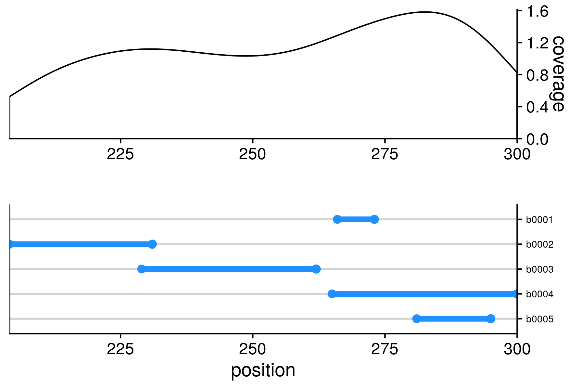

# Auxiliary R scripts of the IntaRNA package


# `plotRegions.R` - Visualization of RRI-covered regions

To visualize sequences' regions covered by RNA-RNA interactions predicted by
IntaRNA, you can use `plotRegions.R` by providing the following arguments (in 
the given order)

1. CSV-IntaRNA output file (semicolon separated) covering the columns `start,end,id`
  with suffix `1` or `2` to plot target or query regions, respectively
2. `1` or `2` to select whether to plot target or query regions
3. output file name with a file-format-specific suffix from `.pdf`, `.png`, 
  `.svg`, `.eps`, `.ps`, `.jpeg`, `.tiff`

An example is given below, when calling
```bash
Rscript --slave -f plotRegions.R --args pred.csv 1 regions.png
```

with `pred.csv` containing
```
id1;start1;end1;id2;start2;end2
b0001;266;273;query;116;123
b0002;204;231;query;85;111
b0003;229;262;query;96;125
b0004;265;300;query;10;38
b0005;281;295;query;5;22
```

will produce the output


