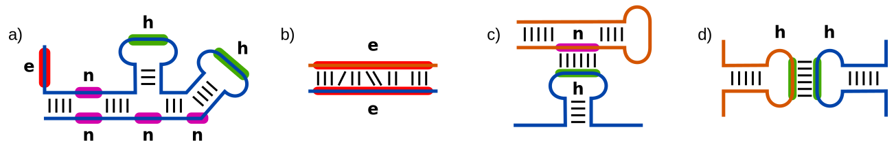

# IntaRNA [](https://github.com/BackofenLab/IntaRNA/releases)  [](https://anaconda.org/bioconda/intarna) [](https://quay.io/repository/biocontainers/intarna) [](https://travis-ci.org/BackofenLab/IntaRNA)

**Efficient RNA-RNA interaction prediction incorporating accessibility and
seeding of interaction sites**

During the last few years, several new small regulatory RNAs
(sRNAs) have been discovered in bacteria. Most of them act as post-transcriptional
regulators by base pairing to a target mRNA, causing translational repressionex
or activation, or mRNA degradation. Numerous sRNAs have already been identified,
but the number of experimentally verified targets is considerably lower.
Consequently, computational target prediction is in great demand. Many existing
target prediction programs neglect the accessibility of target sites and the
existence of a seed, while other approaches are either specialized to certain
types of RNAs or too slow for genome-wide searches.

IntaRNA, developed by 
[Prof. Backofen's bioinformatics group at Freiburg University](http://www.bioinf.uni-freiburg.de),
is a general and fast approach to the
prediction of RNA-RNA interactions incorporating both the accessibility of
interacting sites
as well as the existence of a user-definable seed interaction. We successfully applied
IntaRNA to the prediction of bacterial sRNA targets and determined the exact
locations of the interactions with a higher accuracy than competing programs.

For testing or ad hoc use of IntaRNA, you can use its webinterface at the

**==> [Freiburg RNA tools IntaRNA webserver](http://rna.informatik.uni-freiburg.de/IntaRNA/) <==**


## Contribution

Feel free to contribute to this project by writing
[Issues](https://github.com/BackofenLab/IntaRNA/issues)
with feature requests, bug reports, or just contact messages.

## Citation

If you use IntaRNA, please cite our respective articles

#### Method

- [IntaRNA 2.0: enhanced and customizable prediction of RNA-RNA interactions](https://doi.org/10.1093/nar/gkx279)
  Martin Mann, Patrick R. Wright, and Rolf Backofen,
  Nucleic Acids Research, 45 (W1), W435–W439, 2017, DOI:[10.1093/nar/gkx279](https://doi.org/10.1093/nar/gkx279).
- [IntaRNA: efficient prediction of bacterial sRNA targets incorporating target site accessibility and seed regions](https://doi.org/10.1093/bioinformatics/btn544)
  Anke Busch, Andreas S. Richter, and Rolf Backofen,
  Bioinformatics, 24 no. 24 pp. 2849-56, 2008, DOI:[10.1093/bioinformatics/btn544](https://doi.org/10.1093/bioinformatics/btn544).
  
#### Features and Application

- [Integration of accessibility data from structure probing into RNA–RNA interaction prediction](https://doi.org/10.1093/bioinformatics/bty1029)
  Milad Miladi, Soheila Montaseri, Rolf Backofen, Martin Raden,
  Bioinformatics, 2019, DOI:[10.1093/bioinformatics/bty1029](https://doi.org/10.1093/bioinformatics/bty1029).
- [Constraint maximal inter-molecular helix lengths within RNA-RNA interaction prediction improves bacterial sRNA target prediction.](http://insticc.org/node/TechnicalProgram/biostec/presentationDetails/76897)
  Rick Gelhausen, Sebastian Will, Ivo L. Hofacker, Rolf Backofen, and Martin Raden,
   In Proc. of the 10th International Conference on Bioinformatics Models, Methods and Algorithms. INSTICC, SciTePress, 2019
- [CopraRNA and IntaRNA: predicting small RNA targets, networks and interaction domains](https://doi.org/10.1093/nar/gku359)
  Patrick R. Wright, Jens Georg, Martin Mann, Dragos A. Sorescu, Andreas S. Richter, Steffen Lott, Robert Kleinkauf, Wolfgang R. Hess, and Rolf Backofen,
  Nucleic Acids Research, 42 (W1), W119-W123, 2014, DOI:[10.1093/nar/gku359](https://doi.org/10.1093/nar/gku359).


<br /><br /><br /><br />
<a name="doc" />

# Documentation

## Overview

The following topics are covered by this documentation:

- [Installation](#install)
  - [IntaRNA via conda](#instconda)
  - [IntaRNA docker container](#instdocker)
  - [Dependencies](#deps)
  - [Cloning from github](#instgithub)
  - [Source code distribution](#instsource)
  - [Microsoft Windows installation](#instwin)
  - [OS X installation with homebrew](#instosx)
- [Usage and Parameters](#usage)
- [Just run ...](#defaultRun)
  - [Multi-threading and parallelized computation](#multithreading)
  - [Load arguments from file](#parameterFile)
- [General things you should know](#generalInformation)
  - [Interaction Model](#interactionModel)
    - [Single-site, unconstraint RNA-RNA interaction](#interactionModel-ssUnconstraintMfe)
    - [Single-site, helix-based RNA-RNA interaction](#interactionModel-ssHelixBlockMfe)
  - [Prediction modes](#predModes)
    - [Emulating other RNA-RNA interaction prediction tools](#predEmulateTools)
    - [Limiting memory consumption - window-based prediction](#predWindowBased)
  - [IntaRNA's multiple personalities](#personality)
    - [IntaRNA - default](#IntaRNA)
    - [IntaRNAhelix - helix-based predictions](#IntaRNAhelix)
    - [IntaRNAup - RNAup-like predictions](#IntaRNAup)
    - [IntaRNAduplex - RNAduplex-like predictions](#IntaRNAduplex)
- [How to constrain predicted interactions](#constraintSetup)
  - [Interaction restrictions](#interConstr)
  - [Seed constraints](#seed)
  - [Explicit seed input](#seedExplicit)
  - [Helix constraints](#helix)
  - [SHAPE reactivity data to enhance accessibility computation](#shape)
- [Output Setup](#outputSetup)
  - [Output modes](#outmodes)
  - [Suboptimal RNA-RNA interaction prediction and output restrictions](#subopts)
  - [Energy parameters and temperature](#energy)
  - [Additional output files](#outFiles)
    - [Minimal energy profiles](#profileMinE)
    - [Minimal energy for all intermolecular index pairs](#pairMinE)
    - [Spot probability profiles](#profileSpotProb) using partition functions
    - [Interaction probabilities for interaction spots of interest](#spotProb)
    - [Accessibility and unpaired probabilities](#accessibility)
      - [Local versus global unpaired probabilities](#accLocalGlobal)
      - [Constrain regions to be accessible or blocked](#accConstraints)
      - [Read/write accessibility from/to file or stream](#accFromFile)
- [Library for integration in external tools](#lib)


<br /><br /><br /><br />
<a name="install" />

# Installation

<br /><br />
<a name="instconda" />

## IntaRNA via conda (bioconda channel)

The most easy way to locally install IntaRNA is via conda using the
[bioconda](https://bioconda.github.io/)
channel (linux only). This way, you will install a pre-built IntaRNA binary along
with all dependencies.
Follow
[](http://bioconda.github.io/recipes/intarna/README.html)
to get detailed information or run
```bash
conda install -c conda-forge -c bioconda intarna
```
if you are using bioconda already.

[ back to overview](#overview)
<br /><br />
<a name="instdocker" />

## IntaRNA docker container (via QUAY)

An [IntaRNA docker container](https://quay.io/repository/biocontainers/intarna)
([?](https://www.docker.com/)) is provided from the bioconda package via
[Quay.io](https://quay.io/). This provides
you with an encapsulated IntaRNA installation.


[ back to overview](#overview)
<br /><br />
<a name="deps" />

## Dependencies

If you are going to compile IntaRNA from source, ensure you meet the following
dependencies:

- compiler supporting C++11 standard and OpenMP
- [boost C++ library](http://www.boost.org/) version >= 1.50.0
  (ensure the following libraries are installed for development (not just runtime libraries!); or install all e.g. in Ubuntu via package `libboost-all-dev`)
    - libboost_regex
    - libboost_program_options
    - libboost_filesystem
    - libboost_system
- [Vienna RNA package](http://www.tbi.univie.ac.at/RNA/) version >= 2.4.8
- `pkg-config` for detailed version checks of dependencies
- if [cloning from github](#instgithub): GNU autotools (automake, autoconf, ..)

Also used by IntaRNA, but already part of the source code distribution (and thus
not needed to be installed separately):

- [Catch](https://github.com/philsquared/Catch) test framework
- [Easylogging++](https://github.com/easylogging/easyloggingpp) logging framework


[ back to overview](#overview)
<br /><br />
<a name="instgithub" />

## Cloning *Source code* from github (or downloading ZIP-file)

The data provided within the github repository
(or within the `Source code` archives provided at the  
[IntaRNA release page](https://github.com/BackofenLab/IntaRNA/releases))
is no complete distribution and
lacks all system specifically generated files. Thus, in order to get started with
a fresh clone of the IntaRNA source code repository you have to run the GNU autotools
to generate all needed files for a proper `configure` and `make`. To this end,
we provide the helper script `autotools-init.sh` that can be run as shown in the following.
```bash
# call aclocal, automake, autoconf
bash ./autotools-init.sh
```
Afterwards, you can continue as if you would have downloaded an
[IntaRNA package distribution](#instsource).


[ back to overview](#overview)
<br /><br />
<a name="instsource" />

## IntaRNA package distribution (e.g. `intaRNA-2.0.0.tar.gz`)

When downloading an IntaRNA package distribution (e.g. `intaRNA-2.0.0.tar.gz`) from the
[IntaRNA release page](https://github.com/BackofenLab/IntaRNA/releases), you should
first ensure, that you have all [dependencies](#deps) installed. If so, you can
simply run the following (assuming `bash` shell).
```bash
# generate system specific files (use -h for options)
./configure
# compile IntaRNA from source
make
# run tests to ensure all went fine
make tests
# install (use 'configure --prefix=XXX' to change default install directory)
make install
# (alternatively) install to directory XYZ
make install prefix=XYZ
```

If you installed one of the dependencies in a non-standard directory, you have
to use the according `configure` options:
- `--with-vrna` : the prefix where the Vienna RNA package is installed
- `--with-boost` : the prefix where the boost library is installed

Note, the latter is for instance the case if your `configure` call returns an
error message as follows:
```[bash]
checking whether the Boost::System library is available... yes
configure: error: Could not find a version of the library!
```
In that case your boost libraries are most likely installed to a non-standard
directory that you have to specify either using `--with-boost` or just the
library directory via `--with-boost-libdir`.

[ back to overview](#overview)
<br /><br />
<a name="instwin" />

## Microsoft Windows installation

### ... from source

IntaRNA can be compiled, installed, and used on a Microsoft Windows system when
e.g. using [Cygwin](https://www.cygwin.com/) as 'linux emulator'. Just install
Cygwin with the following packages:

- *Devel*:
   - make
   - gcc-g++
   - autoconf
   - automake
   - pkg-config
- *Libs*:
   - libboost-devel
- *Perl*:
   - perl

and follow either [install from github](#instgithub) or
[install from package](#instsource).

*Note*, the source code comes without any waranties or what-so-ever 
(see licence information)!

### ... using pre-compiled binaries

For some releases, we also provide precompiled binary packages for Microsoft Windows at the
[IntaRNA release page](https://github.com/BackofenLab/IntaRNA/releases)
that enable 'out-of-the-box' usage. If you
want to use them:
- [download](https://github.com/BackofenLab/IntaRNA/releases) the according ZIP archive and extract
- open a [Windows command prompt](https://www.lifewire.com/how-to-open-command-prompt-2618089)
- [run IntaRNA](#usage)

*Note*, these binaries come without any waranties, support or what-so-ever!
They are just an offer due to user requests.

If you do not want to work within the IntaRNA directory or don't want to provide
the full installation path with every IntaRNA call, you should add the installation
directory to your [`Path` System variable](http://www.computerhope.com/issues/ch000549.htm)
(using a semicolon `;` separator).


[ back to overview](#overview)
<br /><br />
<a name="instosx" />

## OS X installation with homebrew (thanks to Lars Barquist)

If you do not want to or can use the pre-compiled binaries for OS X available from
[bioconda](https://anaconda.org/bioconda/intarna), you can compile `IntaRNA`
locally.

The following wraps up how to build `IntaRNA-2.0.2` under OS X (Sierra 10.12.4) using homebrew.

First, install homebrew! :)

```[bash]
brew install gcc --without-multilib
```

`--without-multilib` is necessary for OpenMP multithreading support -- note
OS X default `gcc`/`clang` doesn't support OpenMP, so we need to install standard
`gcc`/`g++`

```[bash]
brew install boost --cc=gcc-6
```

`--cc=gcc-6` is necessary to build `boost` with standard `gcc`, rather than the
default bottle which appears to have been built with the system `clang`.
Brew installs `gcc`/`g++` as `/usr/local/bin/gcc-VERSION` by default to avoid
clashing with the system's `gcc`/`clang`. `6` is the current version as of
writing, but may change.

```[bash]
brew install viennarna
brew install doxygen
```

Download and extract the IntaRNA source code package (e.g. `intaRNA-2.0.2.tar.gz`) from the [release page](releases/).

```[bash]
./configure CC=gcc-6 CXX=g++-6
```

This sets up makefiles to use standard `gcc`/`g++` from brew, which will
need an update to the appropriate compiler version if not still `6`.
You might also want to
set `--prefix=INSTALLPATH` if you dont want to install IntaRNA globally.


```[bash]
make
make tests
make install
```


[ back to overview](#overview)


<br /><br /><br /><br />
<a name="usage" />

# Usage and parameters

IntaRNA comes with a vast variety of ways to tune or enhance *YOUR* RNA-RNA prediction.
To this end, different [prediction modes](#predModes) and 
[interaction models](#interactionModel) 
are implemented that allow
to balance predication quality and runtime requirement. Furthermore, it is
possible to define
[interaction restrictions](#interConstr),
[seed constraints](#seed),
[explicit seed information](#seedExplicit),
[SHAPE reactivity constraints](#shape),
[output modes](#outmodes),
[suboptimal enumeration](#subopts),
[energy parameters, temperature](#energy),
and the [accessibility](#accessibility) handling. If you are doing high-throughput
computations, you might also want to consider [multi-threading support](#multithreading).

For ad hoc usage you can use the
[Freiburg RNA tools IntaRNA webserver](http://rna.informatik.uni-freiburg.de/IntaRNA/)
(with limited parameterization).


[ back to overview](#overview)
<br /><br />
<a name="defaultRun" />

# Just run ...

If you just want to start and are fine with the default parameters set,
you only have to provide two RNA sequences,
a (long) target RNA (using `-t` or `--target`) and a (short) query RNA
(via `-q` or `--query`), in
[IUPAC RNA encoding](#https://en.wikipedia.org/wiki/Nucleic_acid_notation).
You can either directly input the sequences
```bash
# running IntaRNA with direct sequence input
# call : IntaRNA -t CCCCCCCCGGGGGGGGGGGGGG -q CCCCCCC

target
             9     15
             |     |
  5'-CCCCCCCC       GGGGGGG-3'
             GGGGGGG
             |||||||
             CCCCCCC
          3'-       -5'
             |     |
             7     1
query

interaction energy = -10.7116 kcal/mol

```

or provide (multiple) sequence(s) in [FASTA-format](#https://en.wikipedia.org/wiki/FASTA_format).
It is possible to provide either file input or to read the FASTA input from the
STDIN stream.

```bash
# running IntaRNA with FASTA files
IntaRNA -t myTargets.fasta -q myQueries.fasta
# reading query FASTA input from stream via pipe
cat myQueries.fasta | IntaRNA -q STDIN -t myTargets.fasta
```

If you are working with large FASTA input files, e.g. covering a whole
transcriptome, you can restrict the prediction to a subset of the input
sequences using the `--qSet` or `--tSet` parameter as shown in the following.

```bash
# restrict prediction to the second load of 100 target sequences
IntaRNA -t myTranscriptome.fasta --tSet=101-200 -q myQuery.fasta
```

Nucleotide encodings different from `ACGUT` are rewritten as `N` and the respective
positions are not considered to form base pairs (and thus ignored).
Thymine `T` encodings are replaced by uracil `U`, since we apply an RNA-only
energy model.

For a list of general program argument run `-h` or `--help`. For a complete
list covering also more sophisticated options, run `--fullhelp`.


[ back to overview](#overview)

<br /><br />
<a name="multithreading" />

## Multi-threading and parallelized computation

IntaRNA supports the parallelization of the target-query-combination processing.
The maximal number of threads to be used can be specified using the `--threads` parameter.
If `--threads=k != 1`, than *k* predictions are processed in parallel. A value of
`0` requests the maximally available number of threads for this machine.

When using parallelization, you should have the following in mind:

- The memory consumption will be multiplied by the number of threads,
  since each thread runs an independent
  prediction (with according memory consumption). Thus, ensure you have enough
  RAM available when using many threads of memory-demanding
  [prediction modes](#predModes). You might consider [window-based prediction](#predWindowBased)
  to limit the required RAM.

- Parallelization is enabled hierarchically, ie. only one of the following input
  sets is processed in parallel:
  - target sequences (if more than one)
  - if only one target: query sequences (if more than one)
  - if only one target and query: [window combinations](#predWindowBased) (if enabled)

The support for multi-threading can be completely disabled before compilation
using `configure --disable-multithreading`.


[ back to overview](#overview)
<br />
<a name="parameterFile" />

## Load arguments from file

If you are using IntaRNA with similar command line arguments (parameters), you 
might want to reduce the call via the definition of a *parameter file*. To this 
end prepare a file that defines the common parameters in a the following form

```[python]
#################################################################
# my parameter.cfg file to simulate RNAup predictions
#################################################################
# slow but exact predictions
mode   = M
# no seed constraint
noSeed = true
# full global accessibility computation
qAccW  = 0
qAccL  = 0
tAccW  = 0
tAccL  = 0
``` 

where you use the long parameter names without the leading `--`.
Boolean arguments (like `--noSeed`) have to be set to `true`|`1` or `false`|`0`
to be enabled or disabled, respectively. Given this, 
you only have to pass the file name via `--parameterFile=...` and IntaRNA will
parse the additional parameters from your file.

*Note:* parameters specified via the command line take precedence over arguments
from a parameter file. Thus, you can (silently) overwrite parameters that
you have specified within the file.

*Note further:* parameter parsing from parameter file is (in contrast to the
command line parsing) case sensitive!


[ back to overview](#overview)
<br /><br />
<a name="generalInformation" />

# General things you should know


<br /><br />
<a name="interactionModel" />

## RNA-RNA interaction models

IntaRNA supports various models how RNA-RNA interactions are represented.
The model selection has direct consequences for the interaction patterns that
can be predicted by IntaRNA.
Before elaborating the supported models, first terms needed for understanding
and representation:

We denote with a **single site** an interaction pattern of two respective RNA
subsequences Qi..Qk and Tj..Tl that  

- form a *base pair on each end*, i.e. (Qi,Tl) and (Qk,Tj) are pairing, and
- there are *no intra-molecular base pairs* within the two subsequences, i.e.
the subsequences form only inter-molecular base pairs.

Given that we can classify single-site RNA-RNA interactions based on the
structural context of the respective subsequences, which are

- *exterior* - not enclosed by any base pair
- *hairpin loop* - directly enclosed by a base pair
- *non-hairpin loop* - subsequence enclosed by two loops forming a bulge, interior or multi-loop

The following figure shows an RNA structure depiction with context annotations
(abbreviated by resp. first letter) of unpaired regions that can form RNA-RNA interactions.



IntaRNA can predict single-site interactions within any structural context of the respective subsequences.

|   context       | exterior | hairpin loop | non-hairpin loop |
| :-------------: | :------: | :----------: | :--------------: |
| **exterior**    |  |  |  |
| **hairpin**     |  |  |  |
| **non-hairpin loop** |  |  |  |

Note, *concatenation-based approaches* as implemented in UNAfold, NUPACK or RNAcofold can
*only predict exterior-exterior context* combinations (shown by (b) in the figure above)
and are thus not capable
to investigate e.g. common loop-exterior or kissing-hairpin-loop
interaction patterns that are depicted by (c) and (d) in the figure from above, respectively!

A detailed discussion about different prediction approaches and predictable
interaction pattern is available in our publications

- [Interactive implementations of thermodynamics-based RNA structure and RNA-RNA interaction prediction approaches for example-driven teaching.](https://doi.org/10.1371/journal.pcbi.1006341) and
- [Structure and interaction prediction in prokaryotic RNA biology.](https://doi.org/10.1128/microbiolspec.RWR-0001-2017)


[ back to overview](#overview)
<br /><br />
<a name="interactionModel-ssUnconstraintMfe" />

### Unconstraint single-site RNA-RNA interaction with minimal free energy

This *default model* of IntaRNA (`--model=S`) predicts the single-site interaction `I` with 
minimal free energy. That is, it minimizes
```
   arg min (  E_hybrid(I) + ED1(I) + ED2(I)  )
      I
```
where `E_hybrid` represents all energy terms of intermolecular base pairs and 
`ED` corresponds to the energy needed to make the respective subsequences
accessible for inter-molecular base pairing, i.e. removing any possible intra-molecular
base pairs.

The model considers inter-molecular base pair patterns that correspond to 
(helical) stackings, bulges or interior loops, which are depicted in figure (b) from above.
Since intra-molecular base pairs are not explicitely represented, any structural 
context of single-site interactions is considered/possible within IntaRNA 
predictions.

This model is used e.g. by the [IntaRNA](#IntaRNA) and [IntaRNAup](#IntaRNAup)
personalities. 


[ back to overview](#overview)
<br /><br />
<a name="interactionModel-ssHelixBlockMfe" />

### Helix-based single-site RNA-RNA interaction with minimal free energy 

The formation of multiple base pair stackings, i.e. helix formation, requires
a 'winding' of the respective subsequences.
Depending on the structural context, such winding might be sterically and kinetically 
hindered by the necessary unwinding of intra-molecular structural elements.  

The helix-based prediction model aims to incorporate such 
effects into the predictions of IntaRNA.
This is done by restricting the maximum length of inter-molecular helices to a 
specified number of (stacked) base pairs.
That way, 'wound up' subhelices are interspaced by flexible interior loops that
will allow for a more flexible 3D arrangement of the overall helix.

The following figure depicts the effect of the maximum helix length constraints
that only allows for helices up to a specified length. 
That way, long interactions (left) are avoided and replaced by a more flexible 
model composed of short inter-molecular helices (right). 
The blue boxes represent the lenth-bound helices and while the red boxes depict
the interspacing unpaired regions (interior loops).


Note, IntaRNA's helix-block-based model `--model=B` implements a heuristic, which 
only considers for each intermolecular base pair the most stable helix (block) extending
to the right. This results in reduced runtimes while keeping or even improving
the prediction quality in genome wide screens. IntaRNA offers various 
[helix constraints](#helix) to guide which helices are considered for interaction 
prediction.

This model is used by the [IntaRNAhelix](#IntaRNAhelix) personality. 

For further details on the model and the underlying algorithm, please refer to our respective publication

- [Constraint maximal inter-molecular helix lengths within RNA-RNA interaction prediction improves bacterial sRNA target prediction.](http://www.bioinf.uni-freiburg.de/Subpages/publications.html?de#Gelhausen-helixLength-2019.abstract)


[ back to overview](#overview)
<br /><br />
<a name="predModes" />

## Prediction modes

For the prediction of *minimum free energy interactions*, the following modes
and according features are supported and can be set via the `--mode` parameter.
The time and space complexities are given for the prediction of two sequences
of equal length *n*.

| Features | Heuristic `--mode=H` | Exact-SE `--mode=M` | Exact `--mode=E` |
| -------- | :------------------: | :-----------------: | :--------------: |
| Time complexity (prediction only) | O(*n*^2) | O(*n*^4) | O(*n*^4) |
| Space complexity | O(*n*^2) | O(*n*^2) | O(*n*^4) |
| [Seed constraint](#seed) | x | x | x |
| [Explicit seeds](#seedExplicit) | x | x | x |
| [SHAPE reactivity constraint](#shape) | x | x | x |
| No [seed constraint](#seed) | x | x | x |
| Minimum free energy interaction | not guaranteed | x | x |
| Overlapping [suboptimal interactions](#subopts) | x | x | x |
| Non-overlapping [suboptimal interactions](#subopts) | x | - | x |

Note, due to the low run-time requirement of the heuristic prediction mode
(`--mode=H`), heuristic IntaRNA interaction predictions are widely used to screen
for interaction in a genome-wide scale. If you are more interested in specific
details of an interaction site or of two relatively short RNA molecules, you
should investigate the exact prediction mode (`--mode=M`, or `--mode=E`
if non-overlapping suboptimal prediction is required). Note further, the exact
mode `E` should provide the same results as mode `M` but uses dramatically more
memory for computations.


[ back to overview](#overview)
<br /><br />
<a name="predEmulateTools" />

### Emulating other RNA-RNA interaction prediction tools

Given these features, we can emulate and extend a couple of RNA-RNA interaction
tools using IntaRNA.

**TargetScan**, **RNAhybrid** and **RNAduplex** are approaches that predict the interaction hybrid with
minimal interaction energy without consideration whether or not the interacting
subsequences are probably involved involved in intramolecular base pairings. Furthermore,
no seed constraint is taken into account.
This prediction result can be emulated (depending on the used prediction mode)
by running IntaRNA when disabling both the seed constraint
as well as the accessibility integration using
```bash
# prediction results similar to TargetScan/RNAhybrid
IntaRNA [..] --noSeed --qAcc=N --tAcc=N
```
We *add seed-constraint support to TargetScan/RNAhybrid-like computations* by removing the
`--noSeed` flag from the above call.
See [IntaRNAup personality](#IntaRNAup) for additional information.


**RNAup** was one of the first RNA-RNA interaction prediction approaches that took the
accessibility of the interacting subsequences into account while not considering the seed feature.
IntaRNA's exact prediction mode is eventually an alternative implementation when disabling
seed constraint incorporation. Furthermore, the unpaired probabilities used by RNAup to score
the accessibility of subregions are covering the respective overall structural ensemble for each
interacting RNA, such that we have to disable accessibility computation based on local folding (RNAplfold).
Finally, RNAup only predicts interactions for subsequences of length 25.
All this can be setup using
```bash
# prediction results similar to 'RNAup -b' (incorporating accessibility of both RNAs)
IntaRNA --mode=M --noSeed --qAccW=0 --qAccL=0 --qIntLenMax=25 --tAccW=0 --tAccL=0 --tIntLenMax=25
```
We *add seed-constraint support to RNAup-like computations* by removing the
`--noSeed` flag from the above call. 
See [IntaRNAup personality](#IntaRNAup) for additional information.


[ back to overview](#overview)
<br /><br />
<a name="predWindowBased" />

### Limiting memory consumption - window-based prediction

The memory requirement of IntaRNA grows quadratically with lengths of the input
sequences. Thus, for very long input RNAs, the requested memory can exceed the
available RAM of smaller computers.

This can be circumvented by using a window-based prediction where the input
sequences are decomposed in overlapping subsequences (windows) that are
processed individually. That way, the maximal memory consumption is defined by
the (shorter) window length rather the length of the input sequence, resulting
in a user guided memory/RAM consumption.

The window-based computation is enabled by setting the following parameters

- `--windowWidth` : length of the windows/subsequences (value of 0 disables window-based computations)
- `--windowOverlap` : overlap of the windows, which has to be larger than the maximal interaction length (see [`--q|tIntLenMax`](#interConstr))   

Note, window-based computation produces a computational overhead due to
redundant consideration of the overlapping subsequences. Thus, the runtime is
increased proportionally to the ratio of window overlap and length.

If only one query and target are given, window-based computation can be
[parallelized](#multithreading), which typically remedies the computational overhead.


[ back to overview](#overview)
<br /><br />
<a name="personality" />

## IntaRNA's multiple personalities

IntaRNA comes as a powerful tool for RNA-RNA interaction prediction supporting
various [interaction models](#interactionModel), [prediction modi](#predModes) 
and constraints. Thus, it is hard for a non-expert user to find and setup the 
best parameter set for the task at hand.

To provide a better guide how to use IntaRNA, we provide different preset parameter
combinations, where each defines one of IntaRNA's multiple *personalities*.
In the following, we list available personalities and respective use cases.

Each personality can be enabled by either replacing `IntaRNA` with the respective
personality when calling or by setting the input parameter `--personality=...`.

Thus, depending on how you call IntaRNA, it will react differently.. :smile:


[ back to overview](#overview)

### IntaRNA

The standard personality of IntaRNA implements the prediction approach of
[(Busch et al., 2008)](https://doi.org/10.1093/bioinformatics/btn544)
with the extension from 
[(Mann et al., 2017)](https://doi.org/10.1093/nar/gkx279). Thus it uses a fast
heuristic [prediction mode](#predModes) in combination with local 
[accessibility](#accLocalGlobal) estimates. It predicts minimum free energy
RNA-RNA interactions for single-site unconstraint 
[interaction models](#interactionModel-ssUnconstraintMfe).

Thus, IntaRNA provides (typically) optimal predictions on a single inter-molecular
base pair level. Output is per default restricted to the interaction site and
base pairs, since intra-molecular structure is implicitely considered via the
accessibility penalties represented by the ED terms of the energy calculation
(see detailed output).


[ back to overview](#overview)

### IntaRNAhelix

**IntaRNAhelix** provides helix-based RNA-RNA interaction prediction described
in [(Gelhausen et al., 2019)](http://www.bioinf.uni-freiburg.de/Subpages/publications.html?de#Gelhausen-helixLength-2019.abstract).
It therefore enables per default 

- the [helix-based single-site interaction model](#interactionModel-ssHelixBlockMfe)

All other parameters are kept from the normal IntaRNA personality, such that
IntaRNAhelix predicts per default interactions heuristically based on optimal 
helix blocks, which is faster than the normal mode but applies more constraints.
Thus, you should use IntaRNAhelix if you want to focus predictions on stable
subinteractions (helices) and need to do it fast.


[ back to overview](#overview)

### IntaRNAup

**RNAup** was the first accessibility-based RNA-RNA interaction prediction approach
and it implements methods to identify the optimal minimum free energy interaction
for unconstraint, single-site [interaction models](#interactionModel-ssUnconstraintMfe).
IntaRNA also implements analogous methods when exact [prediction modes](#predModes)
are used, and thus can provide [RNAup-like predictions](#predEmulateTools).

**IntaRNAup** therefore 

- uses exact [prediction mode](#predModes) and 
- reports suboptimal interactions that can [overlap in both RNAs](#subopts).

In contrast to RNAup, it also

- enforces [seed constraints](#seed),
- uses local [accessibility](#accLocalGlobal) values, and
- does not [constrain interaction length](#interConstr) to subsequences of length 25.

If needed, you can disables these features.

Compared to the normal IntaRNA personality it

Thus, IntaRNAup produces RNAup-like predictions with the extensive output 
and constraint options of IntaRNA.
Since exact computations are computationally much more demanding, IntaRNAup is
much slower than IntaRNA. 
Therefore, you should use IntaRNAup if you want to investigate the details of a
single or few interactions unbiased by the heuristics applied in normal IntaRNA.
If you are using long RNAs, you should constraint predictions to the [regions of
interest](#interConstr). 


[ back to overview](#overview)

### IntaRNAduplex

**TargetScan**, **RNAhybrid** and **RNAduplex** are approaches that predict the 
RNA-RNA interaction with
minimal free energy without consideration whether or not the interacting
subsequences are accessible. Furthermore, no seed constraint is taken into account.

**IntaRNAduplex** provides analogous predictions by

- disabling [accessibility](#accessibility) consideration.

In constrast to other approaches, it

- uses a fast heuristic [prediction mode](#predModes), and
- enforces [seed constraints](#seed).

Thus, IntaRNAduplex is useful if you are not interested in the structuredness
of the interacting molecules, either since they are very short or very long.
The latter makes accessibility prediction difficult, since it is not only governed
by thermodynamics.


[ back to overview](#overview)
<br /><br />
<a name="constraintSetup" />

# How to constrain predicted interactions


<br /><br />
<a name="interConstr" />

## Interaction restrictions

The predicted RNA-RNA interactions can be enhanced if additional
knowledge is available. To this end, IntaRNA provides different options to
restrict predicted interactions.

A general most general restriction is the maximal energy (inversely related to
stability) an RNA-RNA interaction is allowed to have. Per default, a reported
interaction should have a negative energy (<0) to be energetically favorable.
This report barrier can be altered using `--outMaxE`. For suboptimal interaction
restriction, please refer to [suboptimal interaction prediction](#subopts) section.

Another stability constraint is `--outNoLP`, which forbids lonely, i.e. non-stacked,
inter-molecular base pairs. These are typically not contributing much to the
overall stability and can lead to instable subinteractions when e.g. enclosed
by two large interior loops.

If you are only interested in predictions for highly accessible regions, i.e.
with a high probability to be unpaired, you can use the `--outMinPu` parameter.
If given, each individual position of the interacting subsequences has to have
an unpaired probability reaching at least the given value. This significantly
increases prediction time but will exclude predictions where the formation of
the interaction (intermolecular base pairing) replaces intramolecular base
pairing (where the latter will cause low unpaired probabilities for the
respective positions).

Furthermore, the region where interactions are supposed to occur can be restricted
for target and query independently. To this end, a list of according
subregion-defining index pairs
can be provided using `--qRegion` and `--tRegion`, respectively. The indexing
starts with 1 and should be in the format `from1-end1,from2-end2,..` using
integers. Note, if you want to have predictions individually for each region
combination (rather than just the best for each query-target combination) you
want to add `--outPerRegion` to the call.

If you are dealing with very long sequences it might be useful to use the
*automatic identification of accessible regions*, which dramatically reduces
runtime and memory consumption of IntaRNA since predictions are only done for
individual regions and not for the whole sequence. Here, we use a
heuristic approach that finds and ignores subregions that are unlikely to form
an interaction, resulting in a decomposition of the full sequence range into
intervals of accessible regions. It can be enabled by providing the maximal
length of the resulting intervals via the parameters `--qRegionLenMax` and
`--tRegionLenMax`.<br />
More specifically, starting from the full
sequence's index range, the algorithm iteratively identifies in every too-long
range the window with highest ED value (penalty for non-accessibility). To
this end, it uses windows of length `--seedBP` to find subsequences where it is
most unlikely that a seed might be formed. This window is removed from the range,
which results in two shorter ranges. If a range is shorter than `--seedBP`, it
is completely removed.

Finally, it is possible to restrict the overall length an interaction is allowed
to have. This can be done independently for the query and target sequence using
`--qIntLenMax` and `--tIntLenMax`, respectively. Both default to the full sequence
length (by setting both to 0).


[ back to overview](#overview)
<br /><br />
<a name="seed" />

## Seed constraints

For different types of RNA-RNA interactions it was found that experimentally
verified interactions were showing a short and compact subinteraction of high
stability (= low energy). It was hypothesized that these regions are among the
first formed parts of the full RNA-RNA interaction, and thus considered as the
*seed* of the overall interaction.

Based on this observation, RNA-RNA interaction predictors were enhanced by
incorporating such seed constraints into their prediction pipeline, i.e. a
reported interaction has to feature at least one seed. Typically,
a seed is defined as a short subinteraction of 5-8 consecutive base pairs that
are not enclosing any unpaired nucleotides (or if so only very few).

IntaRNA supports the definition of such seed constraints and adds further
options to even more constrain the seed selection. The list of options is given
by

- `--seedBP` : the number of base pairs within the seed
- `--seedMaxUP` : the maximal overall number of unpaired bases within the seed
- `--seedQMaxUP` : the maximal number of unpaired bases within the query's seed region
- `--seedTMaxUP` : the maximal number of unpaired bases within the target's seed region
- `--seedMaxE` : the maximal overall energy of the seed (to exclude unlikely seed interactions)
- `--seedMaxEhybrid` : the maximal hybridization energy (including E_init) of the seed (to exclude weak seed hybridizations likely to fall off again)
- `--seedMinPu` : the minimal unpaired probability of each seed region in query and target
- `--seedQRange` : a list of index intervals where a seed in the query is allowed
- `--seedTRange` : a list of index intervals where a seed in the target is allowed
- `--seedNoGU` : if present, no GU base pairs are allowed within seeds

Alternatively, you can set

- `--seedTQ` : to specify [explicit seed interactions](#seedExplicit)

Seed constraint usage can be globally disabled using the `--noSeed` flag.


[ back to overview](#overview)
<br /><br />
<a name="seedExplicit" />

### Explicit seed input

Some experiments provide hints or explicit knowledge about the seed or
even provide details about some intermolecular base pairs formed between two RNAs.
This information can be incorporated into IntaRNA predictions by providing
*explicit seed information*. To this end, the `--seedTQ` parameter can be used.
It takes a comma-separated list of seed string encodings in the format
`startTbpsT&startQbpsQ`, which is in the same format as the IntaRNA `hybridDB`
output (see [below](#outModeCsv)), i.e. e.g. `--seedTQ='4|||.|&7||.||'`
(ensure you quote the seed encoding to avoid a shell interpretation of the pipe symbol '|')
to encode a seed interaction like
the following
```bash
target
             4    8
             |    |
      5'-AAAC    C UGGUUUGG-3'
             AC C C
             || | |
             UG G G
      3'-GGUU  U   CCCACAAA-5'
             |    |
            11    7
query
```
If several or alternative seeds are known, you can provide all as a
comma-separated list and IntaRNA will consider all interactions that cover at
least one of them.

[ back to overview](#overview)
<br /><br />
<a name="helix" />

## Helix constraints

For [helix-based interaction models](#interactionModel-ssHelixBlockMfe), 
IntaRNA provides various constraints
for the helices considered for interaction prediction: 

- `--helixMinBP` : minimal number of base pairs inside a helix (min|default=2)
- `--helixMaxBP` : maximal number of base pairs inside a helix
- `--helixMaxE` : maximal energy of each helix; any helix with higher
  energy is not considered for interaction prediction. Note, this constraint is
  useful to restrict the prediction to more stable interactions.
  See also `--helixFullE`.
- `--helixFullE` if present, the overall helix energy (including E_init, ED,
  dangling end contributions, etc.) is used for energy checks (`--helixMaxE`).
  Otherwise, only the loop-terms are considered.
- `--helixMinPu` : minimal unpaired probability (per helix subsequence); thus, one can
  constrain prediction to helices in accessible regions.
- `--helixMaxIL` : maximal size for each internal loop size in a helix; that way
  you can relax the helix definition and allow for a given number of unpaired bases
  between consecutive base pairs within a helix. Note, increasing this value reduces
  the impact of the helix-based model for prediction.


[ back to overview](#overview)

<br /><br />
<a name="shape" />

## SHAPE reactivity data to enhance accessibility computation

For some RNA sequences, experimental reactivity data is available that can be
used to guide/help the structure and thus accessibility prediction for the RNA
molecule. IntaRNA supports such data by interfacing the Vienna RNA package
capabilities for SHAPE reactivity data incorporation, see
Lorenz et al. ([2015](https://doi.org/10.1093/bioinformatics/btv523), [2016](https://dx.doi.org/10.1186%2Fs13015-016-0070-z)) or the
[RNAfold manpage](https://www.tbi.univie.ac.at/RNA/RNAfold.1.html).

The SHAPE reactivity data can be provided via file using `--qShape` or
`--tShape` for query or target sequence, respectively.
Independently for each, it is possible
to define the methods to be used to convert the data into pseudo energies and
pairing probabilities. The respective IntaRNA arguments are
`--qShapeMethod`|`--tShapeMethod`
and `--qShapeConversion`|`--tShapeConversion`, which mimics the according
tool arguments in the Vienna RNA package (see e.g. the
[RNAfold manpage](https://www.tbi.univie.ac.at/RNA/RNAfold.1.html)).

For further details, please refer to our respective publication

- [Integration of accessibility data from structure probing into RNA-RNA interaction prediction.](https://doi.org/10.1093/bioinformatics/bty1029)


[ back to overview](#overview)


<br /><br />
<a name="outputSetup" />

# Output setup


<br /><br />
<a name="outmodes" />

## Output modes

The RNA-RNA interactions predicted by IntaRNA can be provided in different
formats. The style is set via the argument `--outMode` and the different modes
will be discussed below.

Furthermore, it is possible to define *where to output*, i.e. using `--out`
you can either name a file or one of the stream names `STDOUT`|`STDERR`. Note,
any string not matching one of the two stream names is considered a file name.
The file will be overwritten by IntaRNA!

Besides interaction output, you can set the verbosity of computation information
using the `-v` or `--verbose` arguments. To reduce the output to a minimum, you
can redirect all logging output of user information, warnings or verbose output
to a specific file using `--default-log-file=LOGFILENAME`.
If you are not interested in any logging output, redirect it to nirvana via
`--default-log-file=/dev/null`. Note, error output is not redirected and always
given on standard output streams.


[ back to overview](#overview)

<a name="outModeNormal" />

### Standard RNA-RNA interaction output with ASCII chart

The standard output mode `--outMode=D` provides a detailed ASCII chart of the
interaction together with its overall interaction energy.
For an example see the [Just run ...](#defaultRun) section.


[ back to overview](#overview)

<a name="outModeDetailed" />

### Detailed RNA-RNA interaction output with ASCII chart

Using `--outMode=D`, a detailed ASCII chart of the interaction together with
various interaction details will be provided. An example is given below.

```bash
# call: IntaRNA -t AAACACCCCCGGUGGUUUGG -q AAACACCCCCGGUGGUUUGG --outMode=D --seedBP=4


target
             5      12
             |      |
      5'-AAAC   C    UGGUUUGG-3'
             ACC CCGG
             ||| ++++
             UGG GGCC
      3'-GGUU   U    CCCACAAA-5'
             |      |
            16      9
query

interaction seq1   = 5 -- 12
interaction seq2   = 9 -- 16

interaction energy = -2.79 kcal/mol
  = E(init)        = 4.1
  + E(loops)       = -13.9
  + E(dangleLeft)  = -0.46
  + E(dangleRight) = -0.96
  + E(endLeft)     = 0.5
  + E(endRight)    = 0
    : E(hybrid)    = -10.72
  + ED(seq1)       = 3.91
    : Pu(seq1)     = 0
  + ED(seq2)       = 4.02
    : Pu(seq2)     = 0

seed seq1   = 9 -- 12
seed seq2   = 9 -- 12
seed energy = -1.42
seed ED1    = 2.66
seed ED2    = 2.66
seed Pu1    = 0.0133541
seed Pu2    = 0.0133541
```
Position annotations start indexing with 1 at the 5'-end of each RNA.
`ED` values are the energy penalties for reduced [accessibility](#accessibility)
and `Pu` denote unpaired probabilities of the respective interacting subsequences.
Base pairs that are part of putative seed interactions are represented by
`+` symbols within the interaction chart. Note, an interaction can contain more
than one putative seed and all respective base pairs are highlighted. 
In addition, the seed information (given at the end of the output) will provide
information for all possible seeds sorted by increasing energy (ie. the most
stable and thus most likely seed is always given left most).
If you are only interested in the most stable seed, you should add
`--outBestSeedOnly` to the call.


[ back to overview](#overview)

<a name="outModeCsv" />

### Customizable CSV RNA-RNA interaction output

IntaRNA provides via `--outMode=C` a flexible interface to generate RNA-RNA
interaction output in CSV format (using `;` as separator). Note, target sequence
information is listed with index `1` while query sequence information is given
by index `2`.

```bash
# call: IntaRNA -t AAACACCCCCGGUGGUUUGG -q AAACACCCCCGGUGGUUUGG --outMode=C --noSeed --outOverlap=B -n 3
id1;start1;end1;id2;start2;end2;subseqDP;hybridDP;E
target;4;14;query;4;14;CACCCCCGGUG&CACCCCCGGUG;((((...((((&))))...))));-4.14154
target;5;16;query;5;16;ACCCCCGGUGGU&ACCCCCGGUGGU;(((((.((.(((&))))).)).)));-4.04334
target;1;14;query;4;18;AAACACCCCCGGUG&CACCCCCGGUGGUUU;(((((((...((((&))))...)))).)));-2.94305
```
For each prediction, a row in the CSV is generated.

Using the argument `--outCsvCols`, the user can specify what columns are
printed to the output using a comma-separated list of colIds. Available colIds
are

- `id1` : id of first sequence (target)
- `id2` : id of second sequence (query)
- `seq1` : full first sequence
- `seq2` : full second sequence
- `subseq1` : interacting subsequence of first sequence
- `subseq2` : interacting subsequence of second sequence
- `subseqDP` : hybrid subsequences compatible with hybridDP
- `subseqDB` : hybrid subsequences compatible with hybridDB
- `start1` : start index of hybrid in seq1
- `end1` : end index of hybrid in seq1
- `start2` : start index of hybrid in seq2
- `end2` : end index of hybrid in seq2
- `hybridDP` : hybrid in VRNA dot-bracket notation (interaction sites only)
- `hybridDPfull` : hybrid in VRNA dot-bracket notation (full sequence length)
- `hybridDB` : hybrid in dot-bar notation (interactin sites only)
- `hybridDBfull` : hybrid in dot-bar notation (full sequence length)
- `E` : overall interaction energy
- `ED1` : ED value of seq1
- `ED2` : ED value of seq2
- `Pu1` : probability to be accessible for seq1
- `Pu2` : probability to be accessible for seq2
- `E_init` : initiation energy
- `E_loops` : sum of loop energies (excluding E_init)
- `E_dangleL` : dangling end contribution of base pair (start1,end2)
- `E_dangleR` : dangling end contribution of base pair (end1,start2)
- `E_endL` : penalty of closing base pair (start1,end2)
- `E_endR` : penalty of closing base pair (end1,start2)
- `E_hybrid` : energy of hybridization only = E - ED1 - ED2
- `E_norm` : length normalized energy = E / ln(length(seq1)*length(seq2))
- `E_hybridNorm` : length normalized energy of hybridization only = E_hybrid / ln(length(seq1)*length(seq2))
- `seedStart1` : start index of the seed in seq1 (* see below)
- `seedEnd1` : end index of the seed in seq1 (* see below)
- `seedStart2` : start index of the seed in seq2 (* see below)
- `seedEnd2` : end index of the seed in seq2 (* see below)
- `seedE` : overall hybridization energy of the seed only (excluding rest) (* see below)
- `seedED1` : ED value of seq1 of the seed only (excluding rest) (* see below)
- `seedED2` : ED value of seq2 of the seed only (excluding rest) (* see below)
- `seedPu1` : probability of seed region to be accessible for seq1 (* see below)
- `seedPu2` : probability of seed region to be accessible for seq2 (* see below)

(*) Note, since an interaction can cover more than one seed, all `seed*` columns
might contain multiple entries separated by ':' symbols. In order to print only
the most stable (lowest seed energy) seed information add `--outBestSeedOnly`
to the call. 

Using `--outCsvCols ''`, all available columns are added to the output.

Energies are provided in unit *kcal/mol*, probabilities in the interval [0,1].
Position annotations start indexing with 1.

The `hybridDP` format is a dot-bracket notation as e.g. generated by **RNAup**.
Here, for each target sequence position within the interaction,
a '.' represents a position not involved
in the interaction while a '(' marks an interacting position. For the query
sequence this is done analogously but using a ')' for interacting positions.
Both resulting strings are concatenated by a separator '&' to yield a single
string encoding of the interaction's base pairing details.

The `hybridDB` format is similar to the `hybridDP` but also provides site information.
Here, a bar '|' is used in both base pairing encodings (which makes it a 'dot-bar encoding').
Furthermore, each interaction string is prefixed
with the start position of the respective interaction site.

In the following, an altered CSV output for the example from above is generated.
```bash
# call: IntaRNA --outCsvCols=Pu1,Pu2,subseqDB,hybridDB -t AAACACCCCCGGUGGUUUGG -q AAACACCCCCGGUGGUUUGG --outMode=C --noSeed --outOverlap=B -n 3
Pu1;Pu2;subseqDB;hybridDB
0.00133893;0.00133893;4CACCCCCGGUG&4CACCCCCGGUG;4||||...||||&4||||...||||
0.00134094;0.00134094;5ACCCCCGGUGGU&5ACCCCCGGUGGU;5|||||.||.|||&5|||||.||.|||
0.00133686;0.0013368;1AAACACCCCCGGUG&4CACCCCCGGUGGUUU;1|||||||...||||&4||||...||||.|||
```

[ back to overview](#overview)

<a name="outModeV1" />

### Backward compatible IntaRNA v1.* output

If your scripts/whatever is tuned to the old IntaRNA v1.* output, you can use

- `--outMode=1` : IntaRNA v1.* normal output
- `--outMode=O` : IntaRNA v1.* detailed output (former `-o` option)

Note, for for IntaRNA v1.* output, currently *no multi-threading computation* is available!

[ back to overview](#overview)

<br /><br />
<a name="subopts" />

## Suboptimal RNA-RNA interaction prediction and output restrictions

Besides the identification of the optimal (e.g. minimum-free-energy) RNA-RNA
interaction, IntaRNA enables the enumeration of suboptimal interactions. To this
end, the argument `-n N` or `--outNumber=N` can be used to generate up to `N`
interactions for each query-target pair (including the optimal one). Note, the
suboptimal enumeration is increasingly sorted by energy.

Note: suboptimal interaction enumeration is not exhaustive! That is, for each
interaction site (defined by the left- and right-most intermolecular base pair)
only the best interaction is reported! In heuristic prediction mode (default
mode of IntaRNA), this is even less exhaustive, since only for each left-most
interaction boundary one interaction is reported!

Furthermore, it is possible to *restrict (sub)optimal enumeration* using

- `--outMaxE` : maximal energy for any interaction reported
- `--outDeltaE` : maximal energy difference of suboptimal interactions' energy
  to the minimum free energy interaction
- `--outOverlap` : defines if an where overlapping of reported interaction sites
  is allowed (Note, IntaRNA v1.* used implicitly the 'T' mode):
  - 'N' : no overlap neither in target nor query allowed for reported interactions
  - 'B' : overlap allowed for interacting subsequences for both target and query
  - 'T' : overlap allowed for interacting subsequences in target only
  - 'Q' : overlap allowed for interacting subsequences in query only


[ back to overview](#overview)

<br /><br />
<a name="energy" />

## Energy parameters and temperatures

The selection of the correct temperature and energy parameters is cruicial for
a correct RNA-RNA interaction prediction. To this end, various settings are
supported by IntaRNA.

The temperature can be set via `--temperature=C`to set a temperature `C` in
degree Celsius. Note, this is important especially for predictions within plants
etc., since the default temperature is 37°C.

The energy model used can be specified using the `--energy` parameters using

- 'B' for base pair maximization similar to the Nussinov intramolecular structure prediction.
  Here, each base pair contributes an energy term of `-1` independently of its
  structural or sequence context. This mode is mainly useful for study or teaching
  purpose.
- 'V' enables *Nearest Neighbor Model* energy computation similar to the Zuker
  intramolecular structure prediction using the Vienna RNA package routines.
  Within this model, the energy contribution of a base
  pair depends on its directly enclosed (neighbored) basepair and the subsequence(s)
  involved. Different energy parameter sets have been experimentally derived
  in the last decades. Since IntaRNA makes use of the energy evaluation routines
  of the Vienna RNA package, all parameter sets from the Vienna RNA package are
  available for RNA-RNA interaction prediction. Per default, the default parameter
  set of the linked Vienna RNA package version is used. You can change the parameter
  set using the `--energyVRNA` parameter as explained below.

If Vienna RNA package is used for energy computation (`--energy=V`), per default
the default parameter set of the linked Vienna RNA package is used (e.g. the
set `Turner04` for VRNA 2.3.0). If you want to use a different parameter set, you
can provide an according parameter file via `--energyVRNA=MyParamFile`. The
following example exemplifies the use of the old `Turner99` parameter set as
used by IntaRNA v1.*.
```bash
# IntaRNA v1.* like energy parameter setup
IntaRNA --energyVRNA=/usr/local/share/Vienna/rna_turner1999.par --seedMaxE=999
```

To increase prediction quality and to reduce the computational complexity, the
number of unpaired bases between intermolecular base pairs is restricted
(similar to internal loop length restrictions in the Zuker algorithm). The
upper bound can be set independently for the query and target sequence via
`--qIntLoopMax` and `--tIntLoopMax`, respectively, and defaults to 16.

Note, you can shift the energy spectrum using `--energyAdd=..`. The given value
is always added when the overall energy of an interaction is computed. That way,
you can correct for conditional predictions based on given 
[accessibility constraints](#accConstraints).

If lonely (non-stacked) inter-molecular base pairs are of no interest, since they
can lead to instable subinteraction when enclosed by two large interior loops,
one can disable their prediction using `--outNoLP`. 


[ back to overview](#overview)

<br /><br />
<a name="outFiles" />

## Additional output files

IntaRNA v2 enables the generation of various additional information in dedicated
files/streams. The generation of such output is guided by an according (repeated)
definition of the `--out` argument in combination with one of the following
argument prefixes (case insensitive) that have to be colon-separated to the
targeted file/stream name:

- `qSpotProb:`/`tSpotProb:` [query/target's spot probability profile](#profileSpotProb) (CSV format), respectively
- `spotProb:` [all spot probabilities](#spotProb) (CSV format)
- `qMinE:`/`tMinE:` [the query/target's minimal interaction energy profile](profileMinE) (CSV format), respectively
- `pMinE:` [minimal interaction energy for all query-target index pairs](pairMinE) (CSV format)
- `qAcc:`/`tAcc:` the [query/target's ED accessibility values](#accessibility) (RNAplfold-like format), respectively
- `qPu:`/`tPu:` the [query/target's unpaired probabilities](#accessibility) (RNAplfold format; rounded!!), respectively

Note, for *multiple sequences* in FASTA input, the provided file names
are suffixed with `-q#t#` (where `#` denotes the according sequence number
within the input where indexing starts with 1).

Note further, `qPu:`|`tPu:` will report unpaired probability values based on rounded accessibility (ED) values.
Thus, these values will most likely differ from values eg. produced by RNAplfold.
We therefore strongly recommend to store `qAcc:`|`tAcc:` values when you want to use them
as input for subsequent IntaRNA calls!

[ back to overview](#overview)

<br />
<a name="profileMinE" />

### Minimal energy profiles

To get a more global view of possible interaction sites for a pair of interacting
RNAs, one can generate the *minimal energy profile* for each sequence (independently).

For instance, to generate the target's profile, add the following to your IntaRNA
call: `--out=tMinE:MYPROFILEFILE.csv`. For the query's profile, use `--out=qMinE:..` respectively.
This will produce an according CSV-file (`;` separated) with the according minimal
energy profile data that can be visualized with any program of your liking.

In the following, such an output was visualized using R:
```R
d <- read.table("MYPROFLEFILE.csv", header=T, sep=";");
plot( d[,1], d[,3], xlab="sequence index", ylab="minimal energy", type="l", col="blue", lwd=2)
abline(h=0, col="red", lty=2, lwd=2)
```


This plot reveals two less but still stable (*E* below 0) interaction sites beside the
mfe interaction close to the 5'-end of the molecule.


[ back to overview](#overview)

<br />
<a name="pairMinE" />

### Minimal energy for all intermolecular index pairs

To investigate how stable RNA-RNA interactions are distributed for a given pair
of RNAs, you can also generate the minimal energy for all intermolecular index
pairs using `--out=pMinE:MYPAIRMINE.csv`. This generates a CSV file (`;`separated)
holding for each index pair the minimal energy of any interaction covering this
index combination or `NA` if no covers it at all.

This information can be visualized with your preferred program. In the following,
the provided R call is used to generate a heatmap visualization of the
RNA-RNA interaction possibilities.

```R
# read data, skip first column, and replace NA and E>0 values with 0
d <- read.table("MYPAIRMINE.csv",header=T,sep=";");
d <- d[,2:ncol(d)];
d[is.na(d)] = 0;
d[d>0] = 0;
# plot
image( 1:nrow(d), 1:ncol(d), as.matrix(d), col = heat.colors(100), xlab="index in sequence 1", ylab="index in sequence 2");
box();
```

The following plot (for the [minimal energy profile](#profileMinE) example from
above) reveals, that the alternative stable (*E*<0) interactions all involve the
mfe-site in the second sequence and are thus less likely to occure.


[ back to overview](#overview)

<br />
<a name="profileSpotProb" />

### Spot probability profiles

Similarly to [minimal energy profiles](#profileMinE), it is also possible to
compute position-wise probabilities how likely a position is covered by an
interaction, i.e. its *spot probability*. To the end, we compute for each
position *i* the partition function *Zi* of all interactions covering *i*.
Given the overall partition function *Z* including all possible interactions,
the position-speficit spot probability for *i* is given by *Zi/Z*.

Such profiles can be generated using `--out=qSpotProb:MYPROFILEFILE.csv` or
`--out=tSpotProb:...` for the query/target sequence respectively and independently.

Note, instead of a file you can also write the profile to stream using `STDOUT`
or `STDERR` instead of a file name.


[ back to overview](#overview)

<br />
<a name="spotProb" />

### Interaction probabilities for interaction spots of interest

For some research questions, putative regions of interactions are known from
other sources and it is of interest to study the effect of competitive binding
or other scenarios that might influence the accessibility of the interacting
RNAs (e.g. refer to [SHAPE data](#shape) or
[structure/accessibility constraints](#accConstraints)).

To this end, one can specify the spots of interest by intermolecular index pairs,
e.g. using `5&67` to encode the fifth target RNA position (first number of the
encoding) and the 67th query RNA
position (second number of the encoding). Note, indexing starts with 1.
Multiple spots can be provided as comma-separated list. The list in
concert with an output stream/file name (colon-separated) can be passed via the
`--out` argument using the `spotProb:` prefix, e.g.

```[bash]
IntaRNA ... --out=spotProb:5&67,33&12:mySpotProbFile.csv
```

The reported probability is the ratio of according partition functions. That is,
for each interaction `I` that respects all input constraints and has an energy
below 0 (or set `--outMaxE` value) the respective Boltzmann weight `bw(I)`
is computed by `bw(I) = exp( - E(I) / RT )`. This weight is added to the
`overallZ` partition function. Furthermore, we add the weight to a respective
spot associated partition function `spotZ`, if the interaction `I` spans the spot, ie.
the spot's indices are within the interaction subsequences of `I`. If none of
the spots if spanned by `I`, the `noSpotZ` partition function is increased by
`bw(I)`. The final probability of a spot is than given by `spotZ/overallZ` and
the probability of interactions not covering any of the tracked spots is
computed by `noSpotZ/overallZ` and reported for the pseudo-spot encoding `0&0`
(since indexing starts with 1).

*NOTE* and be aware that the probabilities are *only estimates* since IntaRNA
is not considering (in default prediction mode) all possible interactions due
to its heuristic (see [discussion about suboptimal interactions](#subopts)).
Nevertheless, since the Boltzmann probabilities are dominated by the low(est)
energy interactions, we consider the probability estimates as meaningful!

[ back to overview](#overview)

#### Spot probabilities for all intermolecular index pairs

If interested in all intermolecular index pair combinations (all spots), you
can exclude the list from the call and only specify the output file/stream by
`--out="spotProb:MYSPOTPROBFILE.csv"`. The resulting semicolon-separated table provides the spot
probability for each index pair combination, as shown below.

```[bash]
 --> IntaRNA --out="spotProb:STDOUT" -t AAACACCCCCGGUGGUUUGG -q AAACACCCCCGGUGGUUUGG --energy=B -m E --noSeed --out=/dev/null
spotProb;A_1;A_2;A_3;C_4;A_5;C_6;C_7;C_8;C_9;C_10;G_11;G_12;U_13;G_14;G_15;U_16;U_17;U_18;G_19;G_20
A_1;3.29634e-07;1.04259e-06;1.88581e-06;3.92703e-06;6.01889e-06;1.09014e-05;1.98091e-05;3.26691e-05;4.97285e-05;6.40822e-05;0.00114721;0.00220701;0.00540899;0.00237187;0.00360255;0.00701572;0.00700194;0.00417576;0;0
A_2;1.04259e-06;3.29756e-06;6.59127e-06;1.23155e-05;2.15023e-05;3.65021e-05;6.65094e-05;0.000109528;0.000164207;0.000210854;0.00272534;0.00524301;0.00906912;0.00467934;0.00760322;0.0122582;0.0114086;0.00602621;0;0
A_3;1.88581e-06;6.59127e-06;1.46527e-05;2.91728e-05;5.38079e-05;9.40555e-05;0.000179154;0.000297828;0.000439376;0.000558681;0.005502;0.0104376;0.0143365;0.00670991;0.0118697;0.0159918;0.0123526;0.00593264;0;0
C_4;3.92703e-06;1.23155e-05;2.91728e-05;7.35161e-05;0.000143682;0.000297768;0.000618853;0.00101766;0.00145303;0.0017689;0.0102492;0.0153404;0.015348;0.0123563;0.0147842;0.0126304;0.00887796;0.00667471;0.00973898;0.0075106
A_5;6.01889e-06;2.15023e-05;5.38079e-05;0.000143682;0.00027948;0.00055287;0.00115804;0.00206338;0.00313617;0.00403553;0.0127348;0.0189567;0.022699;0.0126698;0.0146316;0.0153814;0.0102196;0.00793081;0.00690787;0.00474379
C_6;1.09014e-05;3.65021e-05;9.40555e-05;0.000297768;0.00055287;0.00127294;0.00278079;0.00507586;0.00801924;0.0102464;0.0234918;0.0277373;0.0219681;0.0173597;0.0181085;0.0126097;0.00712746;0.00444397;0.0150453;0.0139076
C_7;1.98091e-05;6.65094e-05;0.000179154;0.000618853;0.00115804;0.00278079;0.00611847;0.0114976;0.0187521;0.0245813;0.0392287;0.0365652;0.0245582;0.0257423;0.0194922;0.00880615;0.00691222;0.00878555;0.0299224;0.0270425
C_8;3.26691e-05;0.000109528;0.000297828;0.00101766;0.00206338;0.00507586;0.0114976;0.0224763;0.0380841;0.051392;0.0716197;0.0587535;0.0346146;0.0429812;0.0266964;0.00717352;0.00914256;0.0183812;0.0585854;0.0521578
C_9;4.97285e-05;0.000164207;0.000439376;0.00145303;0.00313617;0.00801924;0.0187521;0.0380841;0.0671115;0.0930764;0.115935;0.0830931;0.045061;0.0572892;0.0333122;0.0068722;0.0139344;0.0357869;0.0859975;0.0736521
C_10;6.40822e-05;0.000210854;0.000558681;0.0017689;0.00403553;0.0102464;0.0245813;0.051392;0.0930764;0.12986;0.14737;0.0865541;0.0493791;0.0589481;0.030814;0.00654186;0.0174543;0.0481296;0.085893;0.0665433
G_11;0.00114721;0.00272534;0.005502;0.0102492;0.0127348;0.0234918;0.0392287;0.0716197;0.115935;0.14737;0.136251;0.0740332;0.0512369;0.0438958;0.0218223;0.0117975;0.0219606;0.0500723;0.0522355;0.033636
G_12;0.00220701;0.00524301;0.0104376;0.0153404;0.0189567;0.0277373;0.0365652;0.0587535;0.0830931;0.0865541;0.0740332;0.0495326;0.0356528;0.0244903;0.0175123;0.0140905;0.0164346;0.0207754;0.0228082;0.0156495
U_13;0.00540899;0.00906912;0.0143365;0.015348;0.022699;0.0219681;0.0245582;0.0346146;0.045061;0.0493791;0.0512369;0.0356528;0.0251168;0.0207634;0.017577;0.0111258;0.010028;0.012619;0.0218789;0.0161306
G_14;0.00237187;0.00467934;0.00670991;0.0123563;0.0126698;0.0173597;0.0257423;0.0429812;0.0572892;0.0589481;0.0438958;0.0244903;0.0207634;0.0122356;0.00753315;0.0078345;0.00965907;0.0128517;0.0109001;0.0059406
G_15;0.00360255;0.00760322;0.0118697;0.0147842;0.0146316;0.0181085;0.0194922;0.0266964;0.0333122;0.030814;0.0218223;0.0175123;0.017577;0.00753315;0.00840878;0.00965183;0.00775696;0.0062456;0.00442768;0.00259566
U_16;0.00701572;0.0122582;0.0159918;0.0126304;0.0153814;0.0126097;0.00880615;0.00717352;0.0068722;0.00654186;0.0117975;0.0140905;0.0111258;0.0078345;0.00965183;0.00685222;0.00365991;0.00195865;0.00765631;0.00707759
U_17;0.00700194;0.0114086;0.0123526;0.00887796;0.0102196;0.00712746;0.00691222;0.00914256;0.0139344;0.0174543;0.0219606;0.0164346;0.010028;0.00965907;0.00775696;0.00365991;0.00362107;0.00625881;0.0137988;0.0117224
U_18;0.00417576;0.00602621;0.00593264;0.00667471;0.00793081;0.00444397;0.00878555;0.0183812;0.0357869;0.0481296;0.0500723;0.0207754;0.012619;0.0128517;0.0062456;0.00195865;0.00625881;0.0161844;0.0212005;0.0133051
G_19;0;0;0;0.00973898;0.00690787;0.0150453;0.0299224;0.0585854;0.0859975;0.085893;0.0522355;0.0228082;0.0218789;0.0109001;0.00442768;0.00765631;0.0137988;0.0212005;0.0158313;0.00807077
G_20;0;0;0;0.0075106;0.00474379;0.0139076;0.0270425;0.0521578;0.0736521;0.0665433;0.033636;0.0156495;0.0161306;0.0059406;0.00259566;0.00707759;0.0117224;0.0133051;0.00807077;0.00396313
```

This data can be visualized in heatmaps as discussed for the [minimal energy heatmap](#pairMinE).


[ back to overview](#overview)

<br />
<a name="accessibility" />

### Accessibility and unpaired probabilities

Accessibility describes the availability of an RNA subsequence for intermolecular
base pairing. It can be expressed in terms of the probability of the subsequence
to be unpaired (its *unpaired probability* *Pu*).

A limited accessibility, i.e. a low unpaired probability, can be incorporated into
the RNA-RNA interaction prediction by adding according energy penalties.
These so called *ED* values are transformed unpaired probabilities, i.e. the
penalty for a subsequence partaking in an interaction is given by *ED=-RT log(Pu)*,
where *Pu* denotes the unpaired probability of the subsequence. Within the
IntaRNA energy model, *ED* values for both interacting subsequences are considered.

Accessibility incorporation can be disabled for query or target sequences using
`--qAcc=N` or `--tAcc=N`, respectively.

A setup of `--qAcc=C` or `--tAcc=C` (default) enables accessibility computation
using the selected [energy model](#energy) for query or target sequences, respectively.


[ back to overview](#overview)

<a name="accLocalGlobal" />

#### Local versus global unpaired probabilities

Exact computation of unpaired probabilities (*Pu* terms) is considers all possible
structures the sequence can adopt (the whole structure ensemble). This is referred
to as *global unpaired probabilities* as computed e.g. by **RNAup**.

Since global probability computation is (a) computationally demanding and (b) not
reasonable for long sequences, local RNA folding was suggested, which also enables
according *local unpaired probability* computation, as e.g. done by **RNAplfold**.
Here, a folding window of a defined length 'screens' along the RNA and computes
unpaired probabilities within the window (while only intramolecular base pairs
within the window are considered).

IntaRNA enables both global as well as local unpaired probability computation.
To this end, the sliding window length has to be specified in order to enable/disable
local folding.

##### Use case examples global/local unpaired probability computation

The use of global or local accessibilities can be defined independently
for query and target sequences using `--qAccW|L` and `--tAccW|L`, respectively.
Here, `--?AccW` defines the sliding window length (0 sets it to the whole sequence length)
and `--?AccL` defines the maximal length of considered intramolecular base pairs,
i.e. the maximal number of positions enclosed by a base pair
(0 sets it to the whole sequence length). Both can be defined
independently while respecting `AccL <= AccW`.
```bash
# using global accessibilities for target and query
IntaRNA [..] --qAccW=0 --qAccL=0 --tAccW=0 --qAccL=0
# using global accessibilities for query and local ones for target
IntaRNA [..] --qAccW=0 --qAccL=0 --tAccW=150 --qAccL=100
```

[ back to overview](#overview)

<a name="accConstraints" />

#### Constraints for accessibility computation

For some RNAs additional accessibility information is available. For instance,
it might be known from experiments that some subsequence is unpaired or already
bound by some other factor. The first case (unpaired) makes such regions
especially interesting for interaction prediction and should result in no ED
penalties for these regions. In the second case (blocked) the region should be
excluded from interaction prediction.

To incorporate such information, IntaRNA provides the possibility to constrain
the accessibility computation using the `--qAccConstr` and `--tAccConstr`
parameters. Both take a string encoding for each sequence position whether it is

- `.` unconstrained
- `x` for sure accessible (unpaired)
- `p` paired intramolecularly with some other position of this RNA
- `b` blocked by some other interaction (implies single-strandedness)

Note, *blocked* regions are currently assumed to be bound single-stranded by some
other factor and thus are *treated as unpaired* for ED computation.

```bash
# constraining some central query positions to be blocked by some other molecules
IntaRNA [..] --query="GGGGGGGCCCCCCC" \
        --qAccConstr="...bbbb......."
```

It is also possible to provide a more compact index-range-based encoding of the
constraints, which is especially useful for longer sequences or if you have only
a few constrained regions. To this end, one can provide a comma-separated list
of index ranges that are prefixed with the according constraint letter from
above and a colon. Best check the following examples, which should give a good
idea how to use. Note, indexing is supposed to be based on a minimal index of 1
and all positions not covered by the encoding are assumed to be unconstrained
(which must not to be encoded explicitely).

```bash
# applying the same constraints by different encodings to query and target
# example 1
IntaRNA [..] --qAccConstr="...bbbb....." --tAccConstr="b:4-7"
# example 2
IntaRNA [..] --qAccConstr="..bb..xxp.bb" --tAccConstr="b:3-4,11-12,x:7-8,p:9-9"
```

When constraining the accessibility computation, all predictions are conditional
predictions for the given accessibility constraints. 
If you are still interested in non-conditional results/energies, you will have to
correct the energy computation by providing a respective energy shift to be
applied. By setting `--energyAdd=..`, all energy evaluations will add your given
term and thus IntaRNA will use and provide corrected energy terms.


[ back to overview](#overview)

<a name="accFromFile" />

#### Read/write accessibility from/to file or stream

It is possible to read precomputed accessibility values from file or stream to
avoid their runtime demanding computation. To this end, we support the following
formats

| Input format | produced by |
| ---- | --- |
| RNAplfold unpaired probabilities | `RNAplfold -u` or `IntaRNA --out=*Pu:` |
| RNAplfold-styled ED values | `IntaRNA --out=*Acc:` |

The **RNAplfold** format is a table encoding of a banded upper triangular matrix
with band width l. First row contains a header comment on the data starting with
`#`. Second line encodes the column headers, i.e. the window width per column.
Every successive line starts with the index (starting from 1) of the window end
followed by a tabulator separated list for each windows value in increasing
window length order. That is, column 2 holds values for window length 1, column
3 for length 2, ... . The following provides a short output/input
example for a sequence of length 5 with a maximal window length of 3.

```
#unpaired probabilities
 #i$	l=1	2	3
1	0.9949492	NA	NA
2	0.9949079	0.9941056	NA
3	0.9554214	0.9518663	0.9511048		
4	0.9165814	0.9122866	0.9090283		
5	0.998999	0.915609	0.9117766		
6	0.8549929	0.8541667	0.8448852		

```


##### Use case examples for read/write accessibilities and unpaired probabilities

If you have precomputed data, e.g. the file `plfold_lunp` with unpaired probabilities
computed by **RNAplfold**, you can run

```bash
# fill accessibilities from RNAplfold unpaired probabilities
IntaRNA [..] --qAcc=P --qAccFile=plfold_lunp
# fill accessibilities from RNAplfold unpaired probabilities via pipe
cat plfold_lunp | IntaRNA [..] --qAcc=P --qAccFile=STDIN
```

Another option is to store the accessibility data computed by IntaRNA for
successive calls using

```bash
# storing and reusing (target) accessibility (Pu) data for successive IntaRNA calls
IntaRNA [..] --out=tPu:intarna.target.pu
IntaRNA [..] --tAcc=P --tAccFile=intarna.target.pu
# piping (target) accessibilities (ED values) between IntaRNA calls
IntaRNA [..] --out=tAcc:STDOUT | IntaRNA [..] --tAcc=E --tAccFile=STDIN
```


Note, for *multiple sequences* in FASTA input, one can also load the
accessibilities (for *all* sequencces) from file. To this end, the file names
have to be prefixed with with `s` and the according sequence's number (where indexing
starts with 1) within the FASTA input using a common suffix after the index.
This suffix is to be provided to the according `--?AccFile` argument.
The files generated by `--out=?Acc:...` are already conform to this requirement,
such that you can use the use case examples from above also for multi-sequence
FASTA input.
Note, this is not supported for a piped setup (e.g. via `--out=tAcc:STDOUT`
as shown above), since this does not produce the according output files!


[ back to overview](#overview)

<br /><br /><br /><br />
<a name="lib" />

# Library for integration in external tools

The IntaRNA package also comes with a C++ library `libIntaRNA.a` containing the core classes
and functionalities used within the IntaRNA tool. The whole library comes with
an `IntaRNA` namespace and exhaustive class and member API documentation that is
processed using doxygen to generate html/pdf versions.

When IntaRNA is build while `pkg-config` is present, according pkg-config
information is generated and installed too.

## Mandatory `Easylogging++` initalization !

Since IntaRNA makes heavy use of the `Easylogging++` library, you have to add (and adapt)
the following code to your central code that includes the `main()` function:
```[c++]
// get central IntaRNA-lib definitions and includes
#include <IntaRNA/general.h>
// initialize logging for binary
INITIALIZE_EASYLOGGINGPP

[...]

int main(int argc, char **argv){

[...]
		// set overall logging style
		el::Loggers::reconfigureAllLoggers(el::ConfigurationType::Format, std::string("# %level : %msg"));
		// no log file output
		el::Loggers::reconfigureAllLoggers(el::ConfigurationType::ToFile, std::string("false"));
		el::Loggers::reconfigureAllLoggers(el::ConfigurationType::ToStandardOutput, std::string("true"));
		// set additional logging flags
		el::Loggers::addFlag(el::LoggingFlag::DisableApplicationAbortOnFatalLog);
		el::Loggers::addFlag(el::LoggingFlag::LogDetailedCrashReason);
		el::Loggers::addFlag(el::LoggingFlag::AllowVerboseIfModuleNotSpecified);

		// setup logging with given parameters
		START_EASYLOGGINGPP(argc, argv);
[...]
}
```

Note further, to get the library correctly working the following compiler
flags are used within the IntaRNA configuration:
```[bash]
    CXXFLAGS=" -DELPP_FEATURE_PERFORMANCE_TRACKING -DELPP_NO_DEFAULT_LOG_FILE "
```

[ back to overview](#overview)

### Attributions

[](https://www.freepik.com/free-vector/icons-collection_1638275.htm)
[](https://www.freepik.com/free-vector/icons-collection_1638275.htm)
[](https://www.freepik.com/free-vector/colored-arrows_794372.htm)
Designed by Freepik


