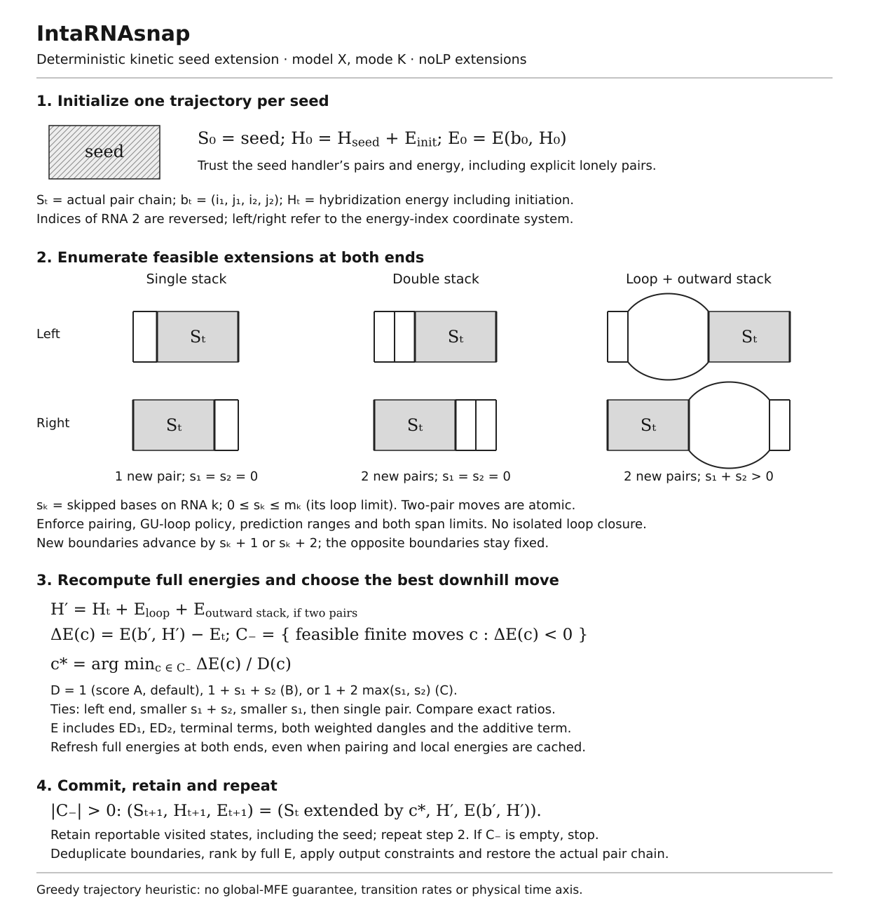

# Deterministic kinetic seed extension

## Scope and modes

`--model=X --mode=K` follows a deterministic downhill path from every seed
provided by the selected seed handler. It compares both ends and commits the
best strictly favorable complete move. This is a zippering-inspired heuristic:
it has no calibrated transition rates or time axis, does not cross barriers
between committed states, and does not guarantee a global minimum. A favorable
two-pair move does not establish a barrier-free physical reaction pathway.

The `IntaRNAkix` personality (kinetic seed extension) selects
`--model=X --mode=K --outNoLP=true`. It can be invoked through the installed
`IntaRNAkix` executable link or `IntaRNA --personality=IntaRNAkix`. Other defaults
remain those of IntaRNA. Ordinary energy trackers are supported; seedless
operation, other interaction models and equilibrium partition/probability
requests are rejected for mode K.



## Seeds, states and allowed extensions

The predictor trusts the seed handler's structure and hybridization energy.
It does not repeat seed complementarity, noLP or GU-loop checks. Explicit seeds
may contain lonely pairs, including at their ends. Finite energy, prediction
ranges and per-strand span limits still apply. Seed annotations come from the
seed handler without an additional predictor-specific whitelist.

A state stores its complete ordered base-pair chain, inclusive boundaries
`(i1,j1,i2,j2)`, hybridization energy `H`, and full interaction energy `E`.
Sequence 2 uses reversed energy indices; existing wrappers handle prediction
range offsets and conversion to original coordinates. Initially,
`H = seedHandler.getSeedE(i1,i2) + energy.getE_init()`.

Extensions **always** use the no-lonely-pair strategy, independent of the API
output constraint. Direct `--mode=K` calls promote a missing or false
`--outNoLP` to true with an INFO message using the normal logging destination;
IntaRNAkix already defaults to true. This applies to new
extensions, not to revalidation of handler-provided seeds. Allowed moves are:

- One pair stacked directly onto the current boundary (`|SEED`).
- Two successive stacked pairs (`||SEED`), evaluated atomically.
- A loop-closing pair followed immediately by its outward stack (`//.SEED`).

For each strand, `sk` denotes the number of skipped bases between the current
boundary and the closing pair. A single-pair move has `s1=s2=0`. Two-pair moves
include all gap pairs from zero through the separate strand loop limits,
subject to available sequence range and maximum interaction span. They advance
each boundary by `sk+2`. Neither an isolated closing pair nor an intermediate
state of a two-pair move is separately committed or reported.

Under `--outNoGUend`, a newly formed nonstacking loop must have non-GU closing
pairs. Stacking can temporarily expose a GU outer endpoint; a state is only
reported if its outer endpoints satisfy the flag. The energy model's own
internal-loop GU policy also applies. Earlier reportable prefixes remain
available if a trajectory stops at an unreportable endpoint.

## Complete energies and deterministic scores

Every geometrically feasible, complementary candidate is evaluated
with the active energy model:

```
H_next = H_current + E_loop + E_stack_if_two_pairs
E_next = energy.getE(i1_next, j1_next, i2_next, j2_next, H_next)
delta  = E_next - E_current
```

`getE()` includes both accessibility penalties, terminal terms, both weighted
dangling ends, and the configured additive term. Updating one end can change
the opposite end's dangling weight, so complete energies must be refreshed
even when local loop energies are reused. Infinite values are excluded before
subtraction. Only `delta < 0` is accepted. Output energy and accessibility
thresholds filter reports, without imposing additional trajectory barriers.

| Score | Quantity minimized |
| --- | --- |
| A (default) | `delta` |
| B | `delta / (1+s1+s2)` |
| C | `delta / (1+2*max(s1,s2))` |

B/C are optional uncalibrated distance preferences. Their denominators count
one move, including two-pair moves. Equal scores prefer left, smaller total
gap, smaller first-strand gap, then a single-pair move. Wide integer cross
products avoid rounding during comparison. Output remains ranked by full `E`.
Two-pair stacking can skip a prefix that the previous implementation visited;
only states actually committed by the revised walk are retained.

## Candidate storage and reuse

Each end has a contiguous rectangular table of two-pair candidates plus its
single-stack candidate. A shared position-pair table records unknown, possible
or impossible complementarity. The closing pair of one candidate may be the
outer pair of another; each such check is resolved once per unchanged end.
The first pass resolves pairing and GU feasibility before the energy pass.
The second pass caches local loop-plus-stack energies and updates the best
candidate as it evaluates full energies, without a separate selection pass.

After committing a move, only that end's tables are rebuilt. The opposite
end's pair checks, feasibility and local energies remain valid. Its total
energy and span eligibility are refreshed. An
initially uphill candidate is retained because it may become downhill when
the opposite end changes. Tables use O((m1+2)(m2+2)) space per end.

## Reporting and validation

Retain each reportable visited prefix and its actual pair chain. For duplicate
boundaries, keep the lowest full energy, then lexicographically smallest chain.
Reduce duplicates before the normal optimum collector. Overlap-constrained
output can select shorter retained prefixes; traceback restores the selected
path directly. Memory for retained paths is proportional to their total length,
not constant per seed. Repeated predictions reset trajectory and candidate caches.

The tests compare K with an independent absolute-endpoint oracle that rebuilds
and reevaluates whole chains. They cover scores/ties, single and double stacks,
positive-loop rescue, strict stopping, separate spans and regions, nonmonotone
ED, GU restrictions, retained prefixes, explicit seeds and annotations, cache
reuse and repeated calls. CLI tests exercise the personality name and option,
explicit parameter overrides, automatic noLP INFO logging, incompatible requests, and
independent reevaluation of predicted structures through `--rri`.

## Preliminary benchmark against default IntaRNA

The small panel uses the repository's tutorial sequences: fhlA/OxyS
(112/108 nt), phoB/GcvB (299/201 nt), and ilvE/GcvB.ST (299/200 nt).
These are the pairs in [hands-on examples 3.2, 3.4 and 3.5](handson/README.md).
No experimental seed, region or accessibility constraints from those examples
are applied here. The raw record includes the sequences and input hashes.

The comparison uses the actual personality defaults: IntaRNA has model X,
mode H and `outNoLP=false`; IntaRNAkix has model X, mode K, score A and
`outNoLP=true`. Thus energy and length deviations reflect both the search and
the different noLP defaults. Default IntaRNA is itself a heuristic, so the
energy deviation is not a certified error from a global optimum.

The review's “noGU” setting is interpreted as `--outNoGUend=true`, the same flag
for both programs. This prohibits GU at reported interaction ends and at
nonstacking loop ends; it does **not** forbid all internal GU pairs.
`--seedNoGU` stays at its default false. The other setting explicitly uses
`--outNoGUend=false`.

Each configuration has one warm-up followed by five measured runs. Execution
order rotates across the four configurations on each pair. All runs use one
thread and compute accessibility from the input sequences. Wall time includes
process startup, accessibility, seed search and prediction; GNU time supplies
the child process's peak resident memory in KiB. The table reports medians;
all samples and min/max values are in the raw JSON. Reported structures and
energies are deterministic across repetitions, and every result is independently
reevaluated via `--rri` outside the timed runs.

For each reported MFE interaction, covered length is
`L = max(end1-start1+1, end2-start2+1)` in the default one-based coordinates.
Signed deviations are `E_kix - E_default` in kcal/mol and `L_kix - L_default`
in nucleotides, compared within the same GU setting. Missing predictions are
recorded as null, never as zero energy or zero length.

Measured on 2026-10-05 on Linux x86-64, AMD Ryzen 5 7530U, using GCC 14.4.0
release (`-O3`, C++23), ViennaRNA 2.7.2, Boost 1.85 and Kokkos mdspan.
No builds or other validation jobs ran alongside these measurements.

| Pair | noGU | Default time (s) | Kix time (s) | Default peak RSS (KiB) | Kix peak RSS (KiB) |
| --- | --- | ---: | ---: | ---: | ---: |
| fhlA/OxyS | off | 0.0569 | 0.0381 | 16,912 | 16,648 |
| fhlA/OxyS | on | 0.0559 | 0.0381 | 16,660 | 16,796 |
| phoB/GcvB | off | 1.0598 | 0.1491 | 18,448 | 18,456 |
| phoB/GcvB | on | 0.7158 | 0.1446 | 18,456 | 18,452 |
| ilvE/GcvB.ST | off | 1.2935 | 0.1471 | 18,440 | 18,512 |
| ilvE/GcvB.ST | on | 1.0233 | 0.1436 | 18,560 | 18,432 |

| Pair | noGU | Default E | Kix E | ΔE (kcal/mol) | Default L | Kix L | ΔL (nt) |
| --- | --- | ---: | ---: | ---: | ---: | ---: | ---: |
| fhlA/OxyS | off | -5.59 | -5.57 | +0.02 | 24 | 7 | -17 |
| fhlA/OxyS | on | -5.57 | -5.57 | +0.00 | 7 | 7 | +0 |
| phoB/GcvB | off | -15.70 | -13.19 | +2.51 | 47 | 8 | -39 |
| phoB/GcvB | on | -13.19 | -13.19 | +0.00 | 8 | 8 | +0 |
| ilvE/GcvB.ST | off | -14.24 | -9.84 | +4.40 | 55 | 13 | -42 |
| ilvE/GcvB.ST | on | -10.55 | -9.13 | +1.42 | 40 | 10 | -30 |

On this small panel, Kix uses 0.11–0.68 times the default runtime. Median peak
RSS differs by less than 2%, within the run-to-run variation. Energy deviations
range from 0 to +4.40 kcal/mol, and length deviations from −42 to 0 nt.
With noGU on, both programs report identical interactions for fhlA/OxyS and
phoB/GcvB. These three selected tutorial pairs are a preliminary performance
and output comparison, not a general speedup or biological-accuracy estimate.

Reproduce from the repository root with a release binary:

```sh
python3 doc/benchmark-kix.py /path/to/release/src/bin/IntaRNA \
  --repetitions=5 --warmups=1 --output=kix-benchmark.json
```

The [script](benchmark-kix.py) uses Python 3 and GNU time. The
[raw results](kix-benchmark-20261005.json) record all samples, predictions,
signed deviations, flags, sequence data, software versions and binary hash.
