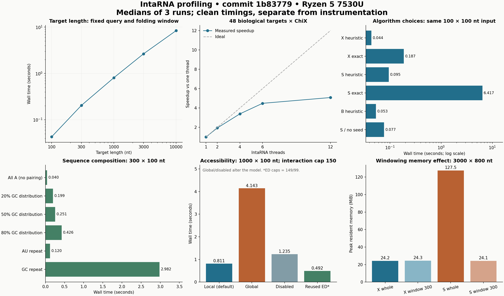

# IntaRNA profiling report

> Historical broad survey. The [21 September follow-up](../2026-09-21/README.md) profiles Martin’s requested default mode on current master and includes new ED evidence and output-stability findings.

Profiled 2026-09-19. **56 workloads, 168 measured repetitions plus 56 excluded warmups, four CPU profiles, four heap traces, and separate phase and structural checks.** The fresh build passed its regression tests; all timed commands and the independent evidence audit passed. The original checkout was left unchanged.

The strongest findings are a **5.08× batch speedup at 12 threads**, a default-mode CPU hotspot in internal-loop energy evaluation, and a substantial time/memory tradeoff from windowing. **An input-stream cleanup defect is confirmed: 100 open/cleanup calls leave 100 file descriptors open.** Reusing accessibility data saved **39.0% latency** in a matched test, but the current ED reader lowers the available interaction limit by one nucleotide. Exact and ensemble modes have different hotspot distributions and need separate optimization work.

## Scope and experimental controls

The council comprised workload, hotspot/tooling, and experimental-methodology reviewers. They exchanged proposals and challenged stale build provenance, thread scaling, accessibility-limit confounding, sampling validity, output equivalence and memory interpretation. Their recommendations are retained in [workloads](council/workloads.md), [hotspots](council/hotspots.md), and [methodology](council/methodology.md). An independent [final audit](council/final-review.md) checked the actual evidence.

Target: `refactor-to-c++23`, commit `1b8377989ba79a0f1b8a450163b71bd8ed7c3e45`, reporting IntaRNA 3.4.1. A clean Git archive was built in `profiling/source`; the pre-existing executable was used only for tooling probes. Build: GCC 16.1.0, C++23, release `-O3`, `-g -fno-omit-frame-pointer`, OpenMP, ViennaRNA 2.7.2, Boost 1.85.0. This is an optimized build with profiling-friendly stack frames, not a debug `-O0` build. Binary SHA-256: `3a082dd37a02b7fb07039565e33c0bbed9ee13c0763d6c2828459cd7a6c442b4`.

Host: AMD Ryzen 5 7530U, six physical cores/twelve logical CPUs, approximately 30.7 GiB RAM, Linux 6.8.0-139, performance governor. All 12 logical CPUs were available; recorded cgroup ancestors imposed no CPU quota or memory maximum. Dynamic frequency and other desktop activity were not disabled. See [environment.json](environment.json) for exact provenance and linked dependencies.

Each case had one excluded warmup and three measured runs. Runs were sequential, with deterministic randomized order in each round; compilation, tests, CPU sampling, heap tracing and verbose logs were separate. The main matrix and later controls have separate randomization blocks. Wall time covers process startup, input, computation and output. GNU time records user/system CPU, process peak RSS, faults, context switches and filesystem I/O. Medians and min–max ranges are reported; three repetitions do not support strong tail-latency or population confidence claims.

The baseline fixes `OPENBLAS_NUM_THREADS=1`, `OMP_DYNAMIC=FALSE`, `OMP_PLACES=cores`, `OMP_PROC_BIND=close`, and `LC_ALL=C`. The BLAS experiment explicitly varies that setting. The linked dependency stack otherwise starts extra BLAS workers independently of IntaRNA's thread option.

Inputs include repository biological examples, the first 48 real 300-nt target records in `NC_000913.fa`, and deterministic synthetic sequences (seed `20260919`). That FASTA is a collection of targets, not one contiguous genome. Length sweeps use nested sequence prefixes. GC-distribution and repeat cases are individual controlled examples, not a representative population of all RNAs. Actual lengths, composition and hashes are in [input manifest](inputs/manifest.json); every command is in [cases.json](cases.json).

## Runtime and scaling

### Biological examples

| Case | Median wall s | Min–max s | Median user / system s | Median peak RSS MiB | Output rows |
|---|---:|---:|---:|---:|---:|
| `bio_fhla_oxys` | 0.053 | 0.053–0.053 | 0.04 / 0.00 | 16.77 | 1 |
| `bio_phob_gcvb` | 0.905 | 0.904–0.910 | 0.89 / 0.00 | 18.29 | 1 |
| `bio_ilve_gcvb` | 1.118 | 1.110–1.120 | 1.11 / 0.00 | 18.16 | 1 |

These inputs are respectively 112×108, 299×201 and 299×200 nt. The last two have almost identical lengths yet different timing, illustrating sequence dependence.

With a fixed 100-nt query and default local accessibility settings, target lengths 100, 300, 1,000, 3,000 and 10,000 nt take 0.043, 0.204, 0.810, 2.657, 8.401 seconds. The 1,000→10,000 range increases time 10.37× for 10× target length. This describes the measured regime with bounded folding/interaction windows; it is not an asymptotic complexity proof.

At 300×100 nt, the composition cases span 0.040 seconds for nonpairing all-A sequences to 2.982 seconds for GC repeats. GC repeats take 11.9× the random 50%-GC-distribution case. Seed density and placement matter in addition to sequence length. Query-length tests intentionally include queries longer than the target; no orientation-invariance claim is made.

### Algorithm choices

On the same 100×100 synthetic input, default X/H takes 0.044 s, exact X/M 0.187 s, heuristic S/H 0.095 s, exact S/M 6.417 s, and helix B/H 0.053 s. Exact S is 147× the default on this case. These modes implement different prediction guarantees and models; their timing differences are not evidence of interchangeable answers.

The suite also covers ensemble P/H and P/M on bounded 40×40 input, seed-only mode, gapped seeds, no lonely pairs, loop limits and suboptimal output. `--noSeed` changes X to S and is labelled accordingly in the council review. Requests for 10 and 100 outputs both return the same ten interactions here; their similar cost does not establish that arbitrary output enumeration is cheap. Seven fixed CSV columns avoid accidentally requesting extra ensemble computations through `--outCsvCols=*`.

### Parallel throughput

| Threads | Median s | Speedup | Evaluated pairs/s | Peak RSS MiB |
|---:|---:|---:|---:|---:|
| 1 | 4.944 | 1.00× | 9.71 | 18.71 |
| 2 | 2.556 | 1.93× | 18.78 | 22.98 |
| 4 | 1.457 | 3.39× | 32.94 | 31.36 |
| 6 | 1.104 | 4.48× | 43.50 | 39.95 |
| 12 | 0.974 | 5.08× | 49.29 | 65.25 |

The denominator is **48 evaluated target–query pairs**, with ChiX length 84; 46 have reportable interactions. All five thread counts produce the same reported coordinates and energies after sorting. A separate comparison including complete base-pair lists confirms equality at one and twelve threads.

Six threads deliver 88.2% of twelve-thread throughput using 61.2% of its RSS. Twelve was fastest among the tested settings. This is throughput from independent targets; a single unwindowed pair does not have the same parallelism. Source scheduling prioritizes targets, then queries, then windows.

## Accessibility and memory

For the 1,000×100 input with an explicit 150-nt interaction cap, local accessibility takes 0.811 s and 20.0 MiB. Global accessibility takes 4.143 s and 86.4 MiB. Disabling accessibility takes 1.235 s, despite removing folding. Accessibility changes energies, admissible boundaries and prediction work; subtracting these runtimes would not isolate folding cost. Separate phase logs provide that attribution.

Reducing accessibility window/span to 75/75 also changes the scientific model. A separate 75-nt interaction-cap control retains the default 150/100 folding settings. Both are recorded so their differences cannot be mistaken for a pure storage optimization.

### Reusing saved accessibility data

The matched target/query limits 149/99 give 0.805 s when computing accessibility and 0.492 s when reloading ED: **1.64× speedup**, with RSS 19.9→14.6 MiB. Coordinates, energies and base-pair lists match. The separately recorded one-time generation took 0.847 s including a complete prediction and serialization; amortize that cost when planning reuse.

**Cache semantic caveat:** the writer emits columns through its configured maximum, while `AccessibilityFromStream.cpp:90–100` advertises one less than the final header length, with a source comment about dangling ends. The saved files contain their last columns; they are not truncated. Original 100/150-limit round-trip runs therefore become 99/149. Their output happens to agree on this example, but only the explicitly matched controls support the cache timing claim. Do not assume this round trip preserves every requested interaction limit. See the [source and file review](council/accessibility_cache_review.md). No application fix was made.

### Prediction windowing

| Mode / 3,000×800 nt input | Whole input seconds | Window300 seconds | Whole peak MiB | Window300 peak MiB |
|---|---:|---:|---:|---:|
| X/H | 41.343 | 71.173 | 24.16 | 24.29 |
| S/H | 21.380 | 59.708 | 127.50 | 24.14 |

Overlap is 150 and the effective interaction cap is 150. X/H's extension matrices are already bounded by interaction length (at most 144×144 per side with the seven-pair seed here). Whole-sequence accessibility still contributes to peak RSS. Windowing processes 95 target/query window combinations and repeat work, explaining the 1.72× time without useful RSS reduction.

S/H keeps two matrices covering the full target/query ranges, so windowing reduces RSS by **81.1%**, while taking 2.79× longer. All tested window comparisons preserve the seven reported CSV fields; full structural equivalence was not separately tested for these window cases. The [window review](council/workload_results_review.md) links these observations to source.

## CPU hotspots and allocations

CPU workloads are a 48-target biological batch with GcvB; a 3,000×400 default-X pair with accessibility disabled and cap 150; 128 repeated 100-nt targets for exact X; and 32 repeated 60-nt targets for exact ensemble P without seeds. Repeated copies make sampling long enough to resolve coarse rankings. These profiles characterize distinct paths, not mutually comparable biological workloads.

The user-space collector emits a timer-reset warning on this host. A nominal 100 ms interval gave sampled totals close to recorded process CPU; shorter nominal intervals failed that calibration in tooling probes. Percentages remain coarse sampled evidence. Optimized stack unwinding misses some ancestors, so inclusive rows must not be added or interpreted as exhaustive phase fractions. The complete tables and warning text remain in `profiles/`.

### CPU hotspots differ by algorithm

Four separate 100 ms sampling runs captured 1,182 samples. All four prediction outputs matched their clean references after removing the collector banner. Sampled CPU totals closely matched the profiler's independently recorded process CPU time.

| Profile | Samples | Sampled CPU | Dominant exclusive CPU functions |
|---|---:|---:|---|
| 48 biological promoters × GcvB, default X/H | 368 | 36.8 s | `getE_interLeft` 57.6%; left extension 12.2%; right extension 7.9% |
| Synthetic 3000 × 400, X/H, accessibility off, interaction cap 150 | 296 | 29.6 s | `getE_interLeft` 72.0%; left extension 8.4%; right extension 8.4% |
| 128 repeated 100 × 100 pairs, exact X/M | 211 | 21.1 s | `getBoltzmannWeight` 19.4%; accessibility lookup `getED` 18.5%; full-energy `getE` 9.5%; unnamed libm routine 9.5% |
| 32 repeated 60 × 60 pairs, ensemble P/M without seed | 307 | 30.7 s | `getE_interLeft` 31.6%; ensemble DP `fillHybridZ` 22.8%; unnamed libm routine 12.1%; `updateZ` 8.1% |

The default predictor spends most of its CPU evaluating internal-loop/stacking energies inside repeated seed-extension recurrences. Exact X/M instead spends most inclusive CPU in candidate scoring (`updateOptima` 83.4%, including its children). Its four boundary-combination loops repeatedly retrieve accessibility energies and compute probability-weighted dangling contributions. The exponential calls are part of the MFE energy model, not evidence of an unnecessary partition-function calculation. Ensemble mode adds Boltzmann-weighted DP and a boundary-keyed partition map; its insertion, reporting and destruction also appear in the profile.

These are exclusive function shares, not additive call-tree phase percentages. Optimized call ancestry is incomplete: for example, `main` contains only 87% of biological samples. The unnamed libm routines remain unnamed; attribution should not be more specific than the symbols support.

### Phase measurements

Built-in timers were collected in separate diagnostic runs. Predictor time includes nested seed filling and reporting.

| Diagnostic workload | Accessibility calls, summed | Predictor calls, summed | Nested seed filling |
|---|---:|---:|---:|
| Biological batch | 3.815 s, 49 calls | 32.848 s, 48 calls | 0.024 s |
| Exact X/M repeated batch | 1.253 s, 129 calls | 19.694 s, 128 calls | 0.015 s |
| Ensemble P/M repeated batch | 0.079 s, 33 calls | 29.244 s, 32 calls | No seed |
| Hybridization without accessibility | Disabled | Displayed “29 seconds”: approximately 29–30 s | 0.009 s |

The first three rows sum millisecond-formatted durations; each individual call loses less than a millisecond through formatting. Longer timers truncate to whole seconds/minutes, so the last row is a range. Among the biological batch's logged major phases, about 10% is accessibility and 90% prediction. Its equal-length promoters still take 435–1,145 ms per prediction with 26–63 valid seeds. Seed count and predictor duration correlate strongly in this sample (Pearson r = 0.899), consistent with repeated extension DP per seed.

### Heap allocation and memory representation

Each heap trace matched its corresponding clean prediction output. Byte counts below are profiler-tracked allocations, not resident memory.

| Heap workload | Allocation calls | Cumulative allocated bytes | Peak tracked heap bytes | Outstanding at shutdown |
|---|---:|---:|---:|---:|
| phoB/GcvB, default X/H | 10,997 | 13,796,710 | 4,554,589 | 14,174 bytes / 20 allocations |
| 100 × 100, exact X/M | 6,392 | 4,250,556 | 1,693,265 | 13,672 bytes / 18 allocations |
| 3000 × 800, default X/H | 64,100 | 238,886,646 | 10,750,986 | 26,554 bytes / 29 allocations |
| 3000 × 800, S/H | 61,660 | 181,619,663 | 118,003,656 | 27,802 bytes / 29 allocations |

The default 3000 × 800 case allocates about 172.5 MB cumulatively at two extension-matrix callsites, across 1,231 allocations at each site: 72% of total allocated bytes. Source inspection identifies per-seed `resize` calls with Boost's default `preserve=true`, which allocates a temporary matrix and copies overlapping contents. This confirms substantial allocation churn, although allocation itself is not a leading sampled CPU hotspot.

S/H instead makes two 57,600,000-byte matrix allocations. Each represents 3000 × 800 cells with a 24-byte energy/right-boundary record; together they explain most of its 118 MB peak tracked heap. This is a structural memory difference between algorithms, not a leak.

### Confirmed input-stream cleanup defect

All four traces retain 9,384 bytes in input-stream allocation stacks. Source `src/IntaRNA/general.cpp:136` casts an input stream to `boost::iostreams::filtering_ostream`, although `newInputStream` creates `filtering_istream`. The cast fails, cleanup is skipped, and the pointer is discarded.

An isolated probe linked against the freshly built IntaRNA library confirmed resource retention: 100 open/read/delete-input-stream iterations increased open file descriptors from **4 to 104**. The probe and result are saved in `scripts/stream_cleanup_probe.cpp`, `scripts/stream_cleanup_probe.sh`, and `results/stream-cleanup-probe.json`. The OS reclaims these resources when the CLI exits; repeated use within a long-lived process accumulates them. Application source was not changed.

Other outstanding allocations include a 4,096-byte stdout buffer, 192 bytes in OpenMP, and ViennaRNA allocation chains. Their presence at shutdown alone does not establish additional application leaks.

## Recommended fixes and optimization priorities

1. **Fix input-stream cleanup.** Correct the stream-type handling in [general.cpp](https://github.com/BackofenLab/IntaRNA/blob/1b8377989ba79a0f1b8a450163b71bd8ed7c3e45/src/IntaRNA/general.cpp#L136) at line 136 and add a repeated-open/cleanup regression check. The supplied probe confirms retained descriptors against the freshly built library; this is a concrete resource defect, separate from speculative performance improvements.
2. **Default X/H: reduce repeated internal-loop energy work.** `InteractionEnergyVrna::getE_interLeft` is the strongest measured CPU hotspot. Inspect repeated sequence-code and base-pair-type lookups, invariant loop bounds, and validation in the nested extension loops before changing the algorithm. Keep exact energy and structural regression checks; no speedup from such a change has been measured here.
3. **Exact X: reduce repeated boundary-energy and dangling-probability work.** Repeated ED lookups and exponentials have a different cost profile from default X. Evaluate caching or hoisting only with a numerical-correctness check and a measured memory tradeoff; these calculations contribute to the thermodynamic score.
4. **Reuse work across predictions.** Batched targets demonstrably parallelize; matched precomputed ED reuse helps repeated runs. Address or explicitly control the reader/writer limit asymmetry before treating caching as transparent.
5. **Ensemble P: measure recurrence and partition-map changes separately.** `fillHybridZ`, loop energy evaluation, exponentials and boundary-map maintenance contribute distinct costs. Preserve the ensemble definition and numerical behavior when evaluating changes.
6. **Treat matrix storage and windowing by algorithm.** The measured RSS benefit is strong for S/H and negligible for this bounded X/H workload. Heap traces and source review identify allocation reuse candidates, but allocation traffic is not itself proof of a dominant runtime bottleneck.
7. **Keep the benchmark harness as a regression baseline.** Compare proposed patches against the same binary provenance, cases, environment, warmups, repetitions and output checks. Report algorithm changes separately from implementation speedups.

## Validation and limits

- Fresh regression tests: 4,281 assertions in 36 API cases, plus all 20 CLI golden cases. No tracked source was changed. Original untracked executables and backup remain intact.
- All 56 benchmark cases completed their warmup and three measured runs. Every case's output was stable. The independent [audit](results/audit.md) verifies 224 records, original stdout/input/binary hashes, resource data, commands, recalculated summaries and structural comparisons.
- Four original no-seed records contain a normal informational log line on stdout. Derived validation excludes that line; the raw evidence is retained. Profiler output comparison similarly excludes only the collector's recognized experiment-creation banner and IntaRNA log lines.
- Excluding the two intentionally varied BLAS cases, the largest min–max range is 4.33% of the median. BLAS-unset and BLAS-12 are noisy: their ranges are 0.081–0.147 s and 0.083–0.132 s, versus 0.052 s with BLAS 1. They demonstrate startup sensitivity, not a precise universal penalty.
- Hardware cycles, IPC, cache misses and branch misses were unavailable: `perf_event_paranoid=4` blocked perf. Syscall tracing was denied; gprofng I/O tracing failed its initialization probe. GNU time resource counters and process CPU evidence are available, but no detailed disk/network/syscall bottleneck claim is made.
- Heap tracing reports allocated bytes, tracked high-water usage and allocations outstanding at process exit. It is not a memory-safety or leak proof. RSS includes additional process mappings and allocator state. Instrumented runs supply attribution, never the clean timing medians.
- This is one build on one laptop-class CPU, with a bounded workload suite and warm page caches. It excludes cross-PR/version comparisons, a full 4,319-target scan, all scientific parameter combinations, NUMA/multi-host scaling, energy-consumption measurement and biological prediction-accuracy benchmarking. Large exact/ensemble runs were deliberately bounded. No universal worst-case or tail-latency claim is made.

## Complete clean timing results

Every row below has three measured repetitions; warmups are excluded. "Peak RSS" is the median of the process high-water marks; maximum observed values are also in [summary.csv](results/summary.csv). Exact arguments and experimental controls are in [cases.json](cases.json).

| Case | Median wall s | Min–max s | Median user / system s | Median peak RSS MiB | Output rows |
|---|---:|---:|---:|---:|---:|
| `bio_fhla_oxys` | 0.053 | 0.053–0.053 | 0.04 / 0.00 | 16.77 | 1 |
| `bio_phob_gcvb` | 0.905 | 0.904–0.910 | 0.89 / 0.00 | 18.29 | 1 |
| `bio_ilve_gcvb` | 1.118 | 1.110–1.120 | 1.11 / 0.00 | 18.16 | 1 |
| `length_t100_q100` | 0.043 | 0.043–0.043 | 0.03 / 0.00 | 16.51 | 1 |
| `length_t300_q100` | 0.204 | 0.204–0.205 | 0.19 / 0.00 | 18.01 | 1 |
| `length_t1000_q100` | 0.810 | 0.807–0.815 | 0.79 / 0.00 | 20.02 | 1 |
| `length_t3000_q100` | 2.657 | 2.653–2.658 | 2.64 / 0.01 | 23.90 | 1 |
| `length_t10000_q100` | 8.401 | 8.389–8.425 | 8.38 / 0.01 | 37.43 | 1 |
| `length_t300_q50` | 0.103 | 0.103–0.104 | 0.09 / 0.00 | 18.30 | 1 |
| `length_t300_q200` | 0.573 | 0.569–0.574 | 0.56 / 0.00 | 18.25 | 1 |
| `length_t300_q400` | 1.210 | 1.209–1.221 | 1.20 / 0.00 | 18.50 | 1 |
| `length_t300_q800` | 3.368 | 3.352–3.369 | 3.35 / 0.01 | 19.38 | 1 |
| `composition_gc20` | 0.199 | 0.197–0.204 | 0.19 / 0.00 | 18.26 | 1 |
| `composition_gc50` | 0.251 | 0.250–0.253 | 0.24 / 0.00 | 18.14 | 1 |
| `composition_gc80` | 0.426 | 0.423–0.426 | 0.41 / 0.00 | 18.26 | 1 |
| `au_repeat` | 0.120 | 0.119–0.121 | 0.11 / 0.00 | 18.26 | 0 |
| `gc_repeat` | 2.982 | 2.963–3.048 | 2.96 / 0.00 | 18.26 | 1 |
| `no_pair` | 0.040 | 0.039–0.040 | 0.03 / 0.00 | 18.14 | 0 |
| `algorithm_default` | 0.044 | 0.043–0.044 | 0.03 / 0.00 | 16.64 | 1 |
| `algorithm_exact_x` | 0.187 | 0.186–0.189 | 0.17 / 0.00 | 16.38 | 1 |
| `algorithm_heuristic_s` | 0.095 | 0.095–0.097 | 0.09 / 0.00 | 16.51 | 1 |
| `algorithm_exact_s` | 6.417 | 6.403–6.464 | 6.41 / 0.00 | 16.64 | 1 |
| `algorithm_helix` | 0.053 | 0.053–0.054 | 0.04 / 0.00 | 16.63 | 1 |
| `algorithm_no_seed` | 0.077 | 0.077–0.077 | 0.06 / 0.00 | 16.63 | 1 |
| `algorithm_gapped_seed` | 0.071 | 0.071–0.073 | 0.06 / 0.00 | 18.04 | 1 |
| `algorithm_seed_only` | 0.032 | 0.032–0.033 | 0.02 / 0.00 | 16.38 | 1 |
| `algorithm_no_lonely_pairs` | 0.035 | 0.034–0.035 | 0.02 / 0.00 | 16.61 | 1 |
| `algorithm_loop0` | 0.033 | 0.032–0.033 | 0.02 / 0.00 | 16.63 | 1 |
| `algorithm_loop30` | 0.066 | 0.066–0.066 | 0.05 / 0.00 | 16.63 | 1 |
| `algorithm_out10` | 0.043 | 0.043–0.043 | 0.03 / 0.00 | 16.63 | 10 |
| `algorithm_out100` | 0.044 | 0.044–0.044 | 0.03 / 0.00 | 16.63 | 10 |
| `ensemble_H` | 0.024 | 0.024–0.025 | 0.01 / 0.00 | 16.11 | 1 |
| `ensemble_M` | 0.126 | 0.125–0.128 | 0.11 / 0.00 | 19.11 | 1 |
| `accessibility_computed` | 0.811 | 0.811–0.812 | 0.80 / 0.00 | 20.03 | 1 |
| `accessibility_none` | 1.235 | 1.229–1.241 | 1.22 / 0.00 | 14.43 | 1 |
| `accessibility_global` | 4.143 | 4.085–4.160 | 4.10 / 0.03 | 86.39 | 1 |
| `accessibility_window75` | 0.582 | 0.580–0.585 | 0.57 / 0.00 | 16.84 | 1 |
| `accessibility_cap75_control` | 0.577 | 0.572–0.597 | 0.56 / 0.00 | 19.63 | 1 |
| `window_300` | 3.435 | 3.432–3.441 | 3.42 / 0.00 | 23.77 | 1 |
| `window_600` | 2.874 | 2.858–2.935 | 2.86 / 0.00 | 23.90 | 1 |
| `throughput_1t` | 4.944 | 4.929–5.006 | 4.85 / 0.08 | 18.71 | 46 |
| `throughput_2t` | 2.556 | 2.527–2.557 | 4.98 / 0.08 | 22.98 | 46 |
| `throughput_4t` | 1.457 | 1.441–1.465 | 5.49 / 0.09 | 31.36 | 46 |
| `throughput_6t` | 1.104 | 1.103–1.130 | 6.03 / 0.10 | 39.95 | 46 |
| `throughput_12t` | 0.974 | 0.970–0.997 | 9.99 / 0.21 | 65.25 | 46 |
| `memory_t3000_q800` | 41.343 | 41.024–41.381 | 41.33 / 0.01 | 24.16 | 1 |
| `memory_window300` | 71.173 | 71.009–71.297 | 71.15 / 0.01 | 24.29 | 1 |
| `cache_computed_control` | 0.821 | 0.806–0.825 | 0.81 / 0.00 | 20.02 | 1 |
| `cache_reused` | 0.490 | 0.490–0.494 | 0.48 / 0.00 | 14.62 | 1 |
| `blas_one_control` | 0.052 | 0.052–0.053 | 0.04 / 0.00 | 16.77 | 1 |
| `blas_unset` | 0.147 | 0.081–0.147 | 1.48 / 0.00 | 18.03 | 1 |
| `blas_twelve` | 0.086 | 0.083–0.132 | 0.89 / 0.00 | 18.02 | 1 |
| `memory_s` | 21.380 | 21.343–21.418 | 21.31 / 0.06 | 127.50 | 1 |
| `memory_s_window300` | 59.708 | 59.652–59.799 | 59.56 / 0.15 | 24.14 | 1 |
| `cache_matched_computed` | 0.805 | 0.805–0.808 | 0.79 / 0.00 | 19.89 | 1 |
| `cache_matched_reused` | 0.492 | 0.491–0.494 | 0.48 / 0.00 | 14.62 | 1 |

## Reproduction and evidence

See [README.md](README.md) for the sequential build/benchmark/profile commands and artifact map. The machine-readable [summary](results/summary.json), [validated and raw run records](intarna-profile-evidence.zip), [CPU/heap output checks](profiles/validated-outputs.json), [phase duration bounds in the evidence archive](intarna-profile-evidence.zip), and [council reviews](council/) preserve the basis for the findings. The archive retains the application C/C++ sources under `profiling/source/`; compiled binaries and large raw gprofng experiments remain with the original local study and are excluded from this PR. See the README for archive verification and reproduction.
