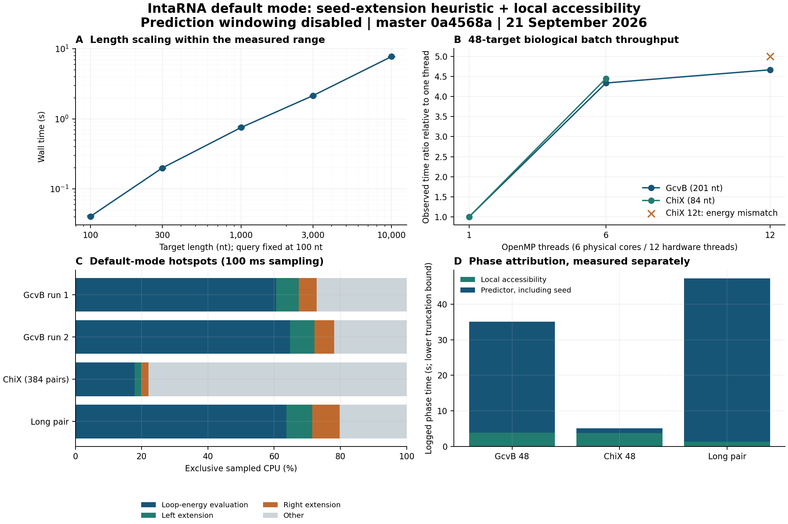

# Default-mode IntaRNA profiling: review follow-up

Profiled 21 September 2026 at current upstream master `0a4568ad6e3da52f935221ff0da98a4a171e9833`. **18 configurations; 90 measured runs plus 18 excluded warmups; four CPU profiles, two heap traces, and three separate phase runs.**

This follows [Martin's requested mode](https://github.com/BackofenLab/IntaRNA/pull/240#issuecomment-5762928155): **seed-extension heuristic, no prediction windowing, computed local accessibility**. [ED-READER-EVIDENCE.md](ED-READER-EVIDENCE.md) answers his separate request for writer/reader evidence and source links.

## Main result

**Two performance regimes appear within the requested default mode.** In the separate diagnostic runs, GcvB spends about 31.3 s in prediction versus 3.82 s in local accessibility; ChiX spends about 1.30 s in prediction versus 3.80 s in local accessibility. Thus prediction accounts for about 89% of GcvB logged phase time, while local accessibility accounts for about 74–75% for ChiX. These are ratios of the logged major phases, not exact wall-time fractions.

Internal-loop energy evaluation accounts for **17.9–64.8%** of exclusive sampled CPU across the default-mode profiles. The independently repeated GcvB profile gives **60.6% and 64.8%**. These samples identify a CPU optimization target; they do not measure an optimization or promise a speedup.

**Correctness finding:** one measured 12-thread ChiX run changed an energy without changing coordinates/base pairs. A further 20 twelve-thread diagnostic runs reproduced an energy difference once on another target. See [OUTPUT-STABILITY.md](OUTPUT-STABILITY.md). The timing data are preserved, but the affected thread setting is not validated as an output-preserving speedup.

Focus seed-extension/loop-energy work on prediction-heavy cases, while retaining an accessibility-heavy case in the acceptance suite. Local accessibility remains enabled. Exact/ensemble modes, prediction tiling, disabling accessibility, and saved-ED workflows do not substitute for this requested performance target.

## Configuration and provenance

Every timed case uses `--model=X --mode=H --acc=C --accW=150 --accL=100 --windowWidth=0 --seedBP=7 --seedMaxUP=0 --intLenMax=0`. These are the scientific defaults. The 150-nt local folding window and 100-nt base-pair span remain enabled; `windowWidth=0` disables prediction tiling. [Source mapping and protocol](README.md#requested-mode-and-recorded-source) explain the distinction.

Output is CSV including full `bpList`; unlike the earlier seven-column output, this retains traceback. It changes formatting from the default text UI, not the prediction algorithm. Explicit versus implicit defaults match full output on three biological examples. Coordinates and base-pair lists match across the tested thread counts, but the 12-thread ChiX case has the energy mismatch described above.

Fresh GCC 16.1.0 C++23 `-O3` build with debug symbols/frame pointers, OpenMP, ViennaRNA 2.7.2, and Boost 1.85.0. Host: AMD Ryzen 5 7530U, six cores/twelve hardware threads, Linux 6.8.0-139, performance governor. BLAS is limited to one worker; OpenMP uses `OMP_DYNAMIC=FALSE`, `OMP_PLACES=cores`, `OMP_PROC_BIND=close`. [Environment and binary hash](environment.json) and [exact case arguments](cases.json) are retained.

The biological batch uses 48 evenly spaced record indices across the 4,319-record repository FASTA, without selecting on outcomes. [Indices](inputs/selection.json) and [input hashes/lengths](inputs/manifest.json) are supplied. This bounded sample is not a full-genome scan. Synthetic sequences use seed `20260921` and nested prefixes.

The source revision includes later upstream changes, including the accepted feasibility optimization. Inputs and output configuration also differ from 19 September; the two studies are **not a before/after benchmark**.

## Clean timing results

Each row contains five measured fresh-process runs after one excluded warmup. Rounds run sequentially in deterministic randomized order. Wall time includes startup, input, accessibility, prediction, traceback, and output. Peak RSS is the median of process high-water marks in MiB, not traced heap allocation. Min/max are observed ranges, not confidence intervals.

| Case | Threads | Median wall s | Min–max s | Median user / system s | Peak RSS MiB | Reported interactions |
| --- | ---: | ---: | ---: | ---: | ---: | ---: |
| `bio_fhla` | 1 | 0.0521 | 0.0519–0.0538 | 0.040 / 0.000 | 16.64 | 1 |
| `bio_phob` | 1 | 0.9133 | 0.9058–0.9184 | 0.900 / 0.000 | 18.18 | 1 |
| `bio_ilve` | 1 | 1.1102 | 1.1053–1.1118 | 1.090 / 0.000 | 18.16 | 1 |
| `length_t100_q100` | 1 | 0.0405 | 0.0399–0.0421 | 0.030 / 0.000 | 16.51 | 1 |
| `length_t300_q100` | 1 | 0.1991 | 0.1972–0.2010 | 0.190 / 0.000 | 18.14 | 1 |
| `length_t1000_q100` | 1 | 0.7526 | 0.7515–0.7827 | 0.740 / 0.000 | 20.02 | 1 |
| `length_t3000_q100` | 1 | 2.1440 | 2.1377–2.1531 | 2.130 / 0.010 | 23.65 | 1 |
| `length_t10000_q100` | 1 | 7.7641 | 7.7494–7.8012 | 7.740 / 0.010 | 37.34 | 1 |
| `length_t300_q200` | 1 | 0.6931 | 0.6917–0.6955 | 0.680 / 0.000 | 18.29 | 1 |
| `length_t300_q400` | 1 | 1.7313 | 1.7240–1.7375 | 1.720 / 0.000 | 18.62 | 1 |
| `length_t300_q800` | 1 | 4.4991 | 4.4843–4.5303 | 4.480 / 0.000 | 19.25 | 1 |
| `long_pair` | 1 | 47.3004 | 47.2701–47.3803 | 47.280 / 0.010 | 24.16 | 1 |
| `batch_gcvb_1t` | 1 | 35.1693 | 35.0498–35.2478 | 35.100 / 0.050 | 18.75 | 48 |
| `batch_gcvb_6t` | 6 | 8.1132 | 8.0022–8.1343 | 45.590 / 0.100 | 38.95 | 48 |
| `batch_gcvb_12t` | 12 | 7.5408 | 7.2977–7.7360 | 79.200 / 0.310 | 63.64 | 48 |
| `batch_chix_1t` | 1 | 5.1085 | 5.1011–5.1348 | 5.020 / 0.080 | 18.71 | 47 |
| `batch_chix_6t` | 6 | 1.1490 | 1.1434–1.1982 | 6.410 / 0.100 | 39.72 | 47 |
| `batch_chix_12t` | 12 | 1.0222 | 1.0095–1.0717 | 10.660 / 0.250 | 65.04 | 47 |

Machine-readable [CSV](results/summary.csv) and [JSON](results/summary.json) include maximum observed RSS and timing scatter. The length sweeps describe these sequences and ranges; they do not establish asymptotic complexity or population averages.

### Biological batch throughput

| Query | Threads | Median wall s | Predictions/s | Speedup | Peak RSS MiB |
| --- | ---: | ---: | ---: | ---: | ---: |
| GCVB | 1 | 35.169 | 1.36 | 1.00x | 18.75 |
| GCVB | 6 | 8.113 | 5.92 | 4.33x | 38.95 |
| GCVB | 12 | 7.541 | 6.37 | 4.66x | 63.64 |
| CHIX | 1 | 5.109 | 9.40 | 1.00x | 18.71 |
| CHIX | 6 | 1.149 | 41.78 | 4.45x | 39.72 |
| CHIX | 12 | 1.022 | 46.96 | 5.00x | 65.04 |

**ChiX at 12 threads: energy output is not stable.** Its table entry is an observed timing ratio, not an accepted correctness-preserving speedup. Throughput counts all 48 evaluated target/query pairs, including pairs with no reportable interaction. These numbers describe batched throughput, not acceleration of a single unwindowed pair.

## CPU attribution in the requested mode

| Profile | Samples | Sampled CPU s | Loop energy self % | Heuristic left self % | Heuristic right self % |
| --- | ---: | ---: | ---: | ---: | ---: |
| GcvB 48, run 1 | 353 | 35.3 | 60.62 | 6.80 | 5.38 |
| GcvB 48, run 2 | 352 | 35.2 | 64.77 | 7.39 | 5.97 |
| ChiX, 48 targets repeated 8x | 408 | 40.8 | 17.89 | 1.96 | 2.21 |
| Synthetic 3000 x 800 nt | 474 | 47.4 | 63.71 | 7.81 | 8.23 |

1,587 total nominal 100-ms samples. The ChiX sampling workload repeats the same 48 targets eight times with unique IDs to lengthen observation; it is not 384 independent biological targets. The second GcvB collection is an independent repeat of the same workload.

The source path is: [per-seed extension](https://github.com/BackofenLab/IntaRNA/blob/0a4568ad6e3da52f935221ff0da98a4a171e9833/src/IntaRNA/PredictorMfe2dHeuristicSeedExtension.cpp#L71-L101), then the [right](https://github.com/BackofenLab/IntaRNA/blob/0a4568ad6e3da52f935221ff0da98a4a171e9833/src/IntaRNA/PredictorMfe2dHeuristicSeedExtension.cpp#L165-L183) and [left](https://github.com/BackofenLab/IntaRNA/blob/0a4568ad6e3da52f935221ff0da98a4a171e9833/src/IntaRNA/PredictorMfe2dHeuristicSeedExtension.cpp#L258-L275) recurrence calls into [`InteractionEnergyVrna::getE_interLeft`](https://github.com/BackofenLab/IntaRNA/blob/0a4568ad6e3da52f935221ff0da98a4a171e9833/src/IntaRNA/InteractionEnergyVrna.h#L377-L407), which checks the internal-loop boundaries, retrieves sequence/base-pair codes, and evaluates the ViennaRNA loop energy.

These are exclusive/self percentages. Inclusive caller rows overlap their children and must not be added. Optimized call ancestry and line attribution can be incomplete. [CPU summary](profiles/cpu-summary.json), original function tables, top source-line tables, annotated source, and collector statistics are preserved in the evidence archive.

### Collector checks and limits

The largest absolute difference between sampled CPU and the collector's process user+system CPU totals is 0.077 s. The collector warning about its interval timer is retained in every affected profile; matching CPU totals and a repeated workload are supporting checks, not proof of perfect sampling. Use these results for coarse hotspot ranking, not precise speedup forecasts or fine differences between percentages.

Hardware counter access was unavailable under the recorded host permissions (`perf_event_paranoid=4`); no IPC, cache-miss, branch-miss, or hardware-stall claims are made. [GNU gprofng documentation](https://sourceware.org/binutils/docs/gprofng.html) describes the function and annotated-source views used here.

## Local accessibility versus prediction phases

Built-in verbose timers run separately from clean timing. Predictor time includes seed filling and reporting. Seed time below is nested and must not be added again. Timers truncate their displayed unit; each cell retains the resulting lower/upper sum bounds.

| Workload | Accessibility calls; seconds [lower, upper) | Predictor calls; seconds [lower, upper) | Nested seed calls; seconds [lower, upper) |
| --- | --- | --- | --- |
| batch_chix_1t | 49; [3.802, 3.851) | 48; [1.300, 1.348) | 48; [0.015, 0.063) |
| batch_gcvb_1t | 49; [3.822, 3.871) | 48; [31.301, 31.349) | 48; [0.021, 0.069) |
| long_pair | 2; [1.300, 1.302) | 1; [46.000, 47.000) | 1; [0.016, 0.017) |

These are diagnostic phase totals, not subtractions of runs with different scientific models. Removing accessibility would change the prediction problem and is not used to estimate its cost.

## Heap behavior

| Workload | Allocation calls | Cumulative bytes allocated | Peak tracked heap bytes | Outstanding at exit bytes |
| --- | ---: | ---: | ---: | ---: |
| batch_gcvb_1t | 235,805 | 429,845,647 | 4,635,487 | 28,322 |
| long_pair | 64,722 | 264,022,639 | 10,749,909 | 25,266 |

Cumulative allocation traffic, peak live traced heap, and resident memory measure different things. Outstanding-at-exit allocations alone do not prove a leak. Allocation stacks and statistics are retained in the archive.

Extension workspaces are [resized inside the seed loop](https://github.com/BackofenLab/IntaRNA/blob/0a4568ad6e3da52f935221ff0da98a4a171e9833/src/IntaRNA/PredictorMfe2dHeuristicSeedExtension.cpp#L80-L101), with dimensions capped by the default interaction/accessibility limits. Allocation volume is a possible implementation cost, but a simple switch to non-preserving resize was already [tested and rejected for lacking a useful end-to-end gain](https://github.com/BackofenLab/IntaRNA/blob/0a4568ad6e3da52f935221ff0da98a4a171e9833/doc/refactor/3-performance.md#L150-L173). This study does not reverse that result.

## Optimization priorities and acceptance criteria

1. **Resolve the observed parallel energy instability before accepting that configuration as a correctness-preserving speedup.** Both occurrences, all raw outputs, and a repeat script are supplied. The root cause is not established; no fix is claimed in this profiling PR.
2. **For prediction-heavy inputs, start in repeated loop-energy evaluation within default seed extension.** Investigate reuse/hoisting of sequence codes, base-pair types, and loop-bound invariants at the recurrence callsites. Preserve thermodynamic terms, boundary checks, target/query asymmetry, offsets, and traceback. A hotspot is a place to test a change, not proof that a particular cache or rewrite helps.
3. **For accessibility-heavy inputs, retain the current local folding model and inspect the accessibility path separately.** ChiX shows substantial ViennaRNA window/probability work and about 74–75% of logged phase time in accessibility. Any API or preprocessing change needs full ED-table/numerical equivalence checks. A gain on an accessibility-disabled case would not satisfy this requested mode.
4. **Respect existing negative experiments.** The [prior phase-3 record](https://github.com/BackofenLab/IntaRNA/blob/0a4568ad6e3da52f935221ff0da98a4a171e9833/doc/refactor/3-performance.md) rejected ED-lookup caching, non-preserving scratch resize, and skipping unused partition merges. A different proposal needs a distinct mechanism and fresh same-parent evidence; do not treat those old candidates as newly validated.
5. **Benchmark each candidate against this exact parent on the same host/build protocol.** Require unchanged energies, coordinates, full base-pair output, seed/tie/constraint behavior, and regression tests. Use both biological queries and the long pair; measure five or more repeated candidate/parent runs in interleaved order, report dispersion and peak RSS, and accept only a useful gain larger than observed noise. No candidate code or optimization speedup is measured in this PR.

## Validation and uncertainty

- Fresh build: **4,334 assertions in 37 API cases**, plus **20 CLI golden cases**, all passed.
- Evidence integrity audit: **PASS, 18 cases / 108 runs**. Scientific output checks: **differences observed**, explicitly retained in the audit rather than treated as equality. [Machine-readable audit](results/audit.json).
- All four CPU profiles, two heap traces, and three phase runs match full prediction output. GcvB matches across 1/6/12 threads; ChiX coordinates/base pairs match, but twelve-thread energies vary. Implicit/explicit defaults match in three biological examples.
- The largest full measured range is **6.09% of the median**, in `batch_chix_12t`. Five repetitions support descriptive statistics, not tight tail estimates or population confidence intervals.
- One laptop, one source revision, a bounded biological sample and a few synthetic sequences. Warm caches, dynamic frequency, shared desktop activity, compiler flags, and dependencies affect applicability. No cross-version, biological-accuracy, or genome-wide performance claim follows.

See [README.md](README.md) for reproducible build, timing, profiling, and archive-verification commands. The prior report remains historical; this follow-up supplies the requested default-mode baseline.
