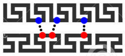

# CopomuS - Compensatory point mutation selector for sRNA-RNA interaction verification



## How it works

CopomuS is a tool for selecting mutation candidate points for sRNA-RNA interactions.
For this it takes different measures for evaluating and ranking each position.
CopomuS is highly configurable for specific purposes, see below for an explanation of all arguments.

## Overview
- [Dependencies](#dependencies)
- [Usage](#usage)
- [Arguments](#arguments)
    - [Measures](#measures)
    - [Candidate Selection](#candidate-selection)
    - [Candidate Filters](#candidate-filters)
    - [Mutation Generators](#mutation-generators)

## Dependencies
- [IntaRNA](https://github.com/BackofenLab/IntaRNA) >= 3.1.2 (needs to be in PATH)
- [python](https://www.python.org/) >= 3.7.0

## Usage
```console
./CopomoS.py -q <query-sequence> -t <target-sequence>

mutation	rank	qIndex	tIndex	bpWildtype	bpMutated	mfeCover_rank	mfeCover_ww	mfeCover_wm	mfeCover_mw	mfeCover_mm	mfeCover_is_valid	E_rank	E_ww	E_wm	E_mw	E_mm	E_is_valid	minDeltaE_rank	minDeltaE_wm/ww	minDeltaE_mw/ww	minDeltaE_wm/mm	minDeltaE_mw/mm	minDeltaE_ww/mm	minDeltaE_min
U4A&A11U	1	4	11	UA	AU	1	True	False	False	True	1	1	-9.32	-5.43	-7.25	-8.46	1	3	3.89	2.07	3.03	1.21	-0.86	1.21
C16G&G1C	2	16	1	CG	GC	1	True	False	True	True	1	2	-9.32	-8.11	-5.31	-5.99	0	5	1.21	4.01	-2.12	0.68	-3.33	-2.12
G15C&C2G	2	15	2	GC	CG	1	True	True	False	True	1	2	-9.32	-12.37	-8.12	-12.2	0	5	-3.05	1.2	-0.17	4.08	2.88	-3.05
...
```

## Arguments

| Flag                | Value                  | Default | Description          |
| :------------------ |:---------------------- | :------ | :-------------------- |
| -h, --help          |                        |         | Gives detailed command help. |
| -q, --query         | sequence               |         | Query as a raw sequence. |
| -t, --target        | sequence               |         | Target as a raw sequence. |
| -m, --measure       | {E, ed1, ed2, maxED, mfeCover, mfeOverlap, spotProb, qAccessProfile, tAccessProfile, qEnergyProfile, tEnergyProfile} | E | The measure used to calculate the rank of a base pair. Can be used multiple times. In that case, base pairs are ranked in order of measurements specified. |
| --qIdxPos0          | integer                | 1       | (Optional) starting index for the query. |
| --tIdxPos0          | integer                | 1       | (Optional) starting index for the target. |
| -c, --candidateSelection | {mfe, mfeSO}      | mfe     | (Optional) method by which base pair candidates are selected from the sequences. |
| -f, --candidateFilters | {GU, AU, CG, lp, lpMfe, he, heMfe} | None     | (Optional) filter by which base pair candidates are filtered. Can be used multiple times to combine filters. |
| -g, --generator     | {flip, any}            | flip    | (Optional) method used to generate mutated sequences by which base pairs are ranked. |
| --mutationEncoding  | string (ex. G1C&U7G)   |         | (Optional) allows specific selection of candidates by specifying a mutation encoding. If this option is specified, -c, -f and -g will be ignored. |
| -o, --output        | file name              | STDOUT  | (Optional) file to which the output should be written to. |
| -d, --delimiter     | character              | "\t" (tab) | (Optional) delimiter used to separate csv output. |
| -p, --parameterFile | file name              | None    | (optional) parameter file to be used in IntaRNA calls to further guide predictions. |
| -t, --threads       | integer                | 0 (all) | (Optional) thread count used by IntaRNA. |

#### Measures

| Name  | Description                                 |
| :---- | :-------------------------------------------|
| E     | (class) Interaction Energy between query and target. |
| minDeltaE | (sort) Energy difference between different combinations of mutation types (ww, wm, mw, mm). |
| mfeCover | (class) Mutation position has to be in MFE. |
| Eqi   | (class) Energy profile on query at mutation position. |
| Eti   | (class) Energy profile on target at mutation position. |
| EDqi  | (sort) Accessibility profile on query at mutation position. |
| cEDqi  | (class) Accessibility profile on query at mutation position needs to be constant. |

The default measure combination is `-m mfeCover -m E -m minDeltaE`.
It is advised to always use a sorting measure at the end, to improve the resolution of the result,
since class measures only split mutations in 3 ranks (valid, invalid, no more interaction).

#### Candidate Selection
The choice specified by this argument defines the method, which is used to select candidate base pairs from the given sequences.

| Name  | Description                                 |
| :---- | :-------------------------------------------|
| mfe   | Selects all base pairs from the MFE region. |
| mfeSO | Selects all base pairs from all suboptimal interactions that are in the MFE region. |

#### Candidate Filters
The filters filter out base pairs from all candidates that do not comply with the constraints.

| Name  | Description                                 |
| :---- | :-------------------------------------------|
| GU    | Filters out any GU or UG base pairs.        |
| AU    | Filters out any AU or UA base pairs.        |
| GC    | Filters out any GC or CG base pairs.        |
| lp    | Filters lonely base pairs that can not stack (both neighbors not in MFE and both neighbors cant pair). |
| lpMfe | Filters lonely base pairs in MFE interaction (both neighbors not in MFE). |
| he    | Filters helix ends (One neighbor can pair, the other one can not). |
| heMfe | Filters helix ends (One neighbor in MFE, the other one is not). |

#### Mutation Generators
The mutation generator chooses the method by which mutated sequences are generated.

| Name  | Description                                 |
| :---- | :-------------------------------------------|
| flip  | Flips a base pair to generate the mutated sequences (for example GC --> CG) |
| any   | Generates all logical base pair combinations from a given base pair (for example GC --> CG, UG, UA) |